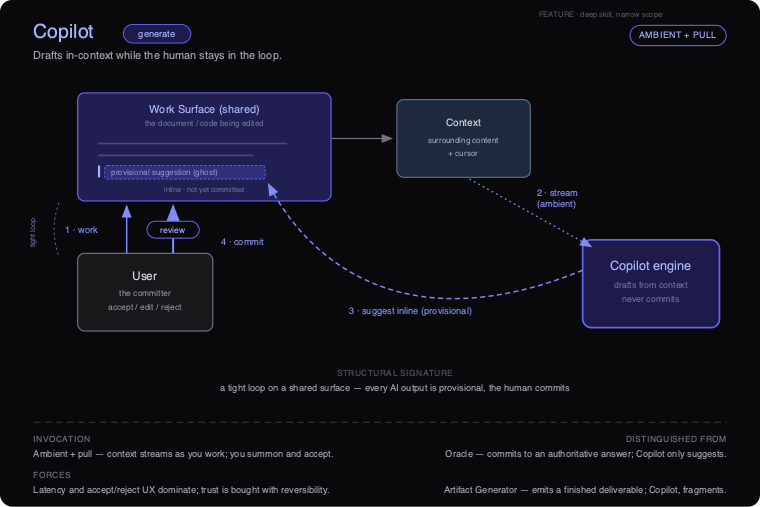
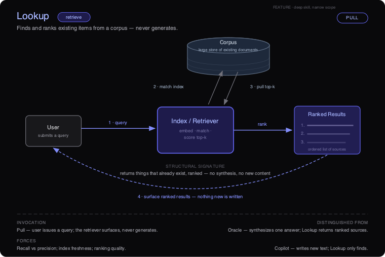
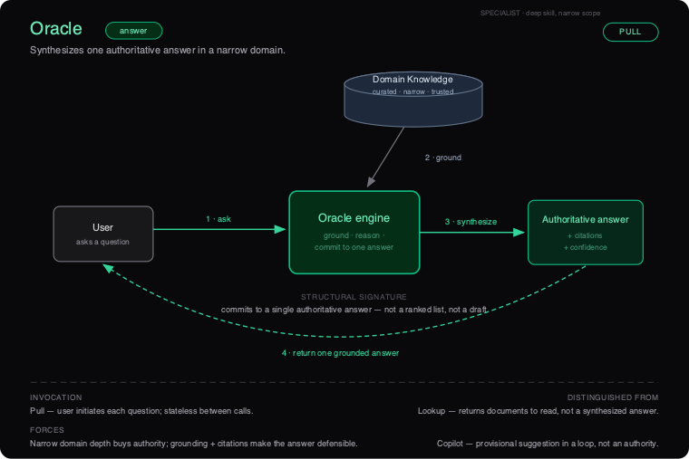
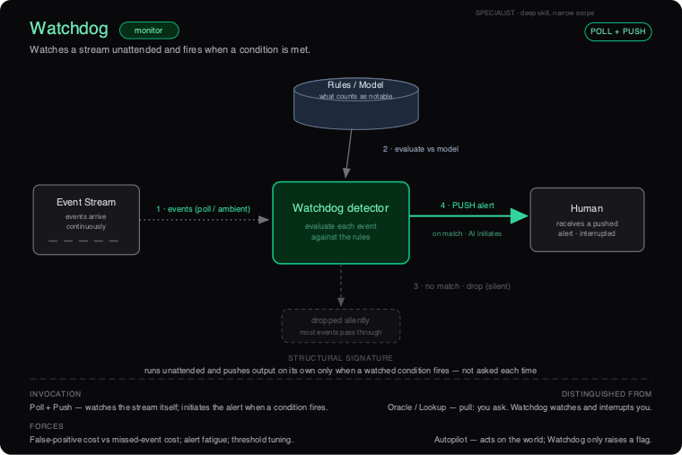
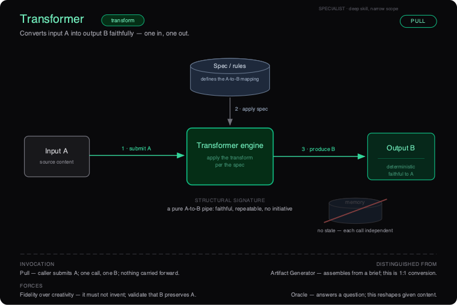
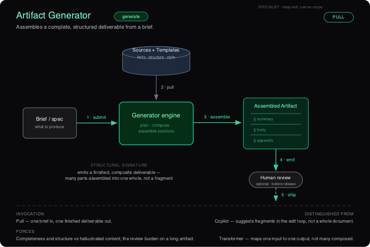
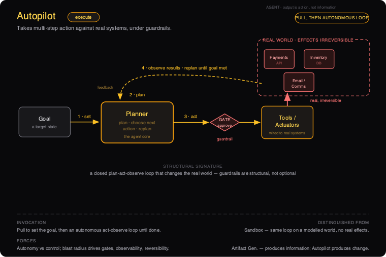
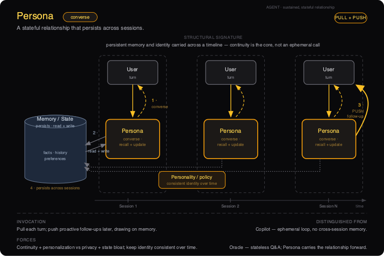
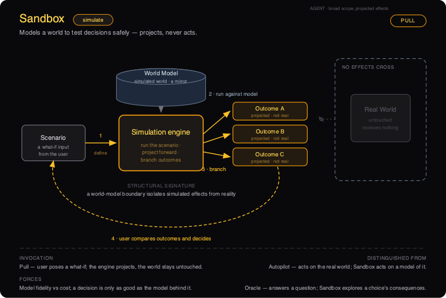

# AI Embedding Design Patterns
### A reference for deciding *how* to put AI inside a product

These are the nine recurring shapes for embedding AI **inside** a product — treated the way the Gang-of-Four or CQRS treat software patterns: each has an intent, a structure, participants, consequences, and clear rules for *when to use it and when not to*.

**The patterns are derived, not collected.** Each is a viable cell of *(primitive verb × skill depth × action breadth)* after pruning the cells that cannot exist. There are **eight primitive verbs across nine patterns** — *retrieve, generate, answer, monitor, transform, execute, converse, simulate* — because **Copilot and Artifact Generator both perform _generate_**; they differ by shape (fragment-in-a-loop vs. composite whole), not by verb.

**How to read this document**

1. Start with **When to use what** — plot your product on readiness first, then pick by the operation you need.
2. Then go to the individual **pattern cards**. Each card's *Applicability* and *Related patterns* sections are written so you can tell neighbouring patterns apart.

**The three lenses every card uses**

- **Agency Shape** = Skill Depth × Action Breadth → *Feature · Specialist · Agent* (and *Noise*, the trap).
- **Adoption Readiness** = AI Maturity × AI Ambition → *Explore · Optimize · Transform* (and the *Danger Zone*).
- **Invocation Protocol** = how it is triggered → *Pull · Poll · Push · Ambient*.

**Build order (a safeguard):** Feature → Specialist → Agent. Deepen skill in a narrow domain before expanding breadth. Skip a step and you land in Noise or the Danger Zone.

---

# When to use what

A front-door selection guide for the nine AI design patterns. Read it top to bottom the first time, then use it as a lookup. The order is deliberate: **readiness gates which patterns are even allowed, the operation you need picks the one, and build order keeps you out of trouble.**

---

## 1. Start from readiness, not ambition

Do not start by asking "what's the most impressive thing AI could do here?" Start by plotting your product on **Adoption Readiness = AI Maturity x AI Ambition**. Maturity is your real infrastructure: data pipelines, evals, tracing, rollback, governance, team skill. Ambition is how much autonomy you want the AI to have. Where you land decides which patterns are on the table at all.

```
                 LOW maturity            HIGH maturity
              +----------------------+----------------------+
HIGH ambition |    DANGER ZONE       |     TRANSFORM        |
              |  ambition > infra    |  Autopilot, Persona, |
              |  -> correct, don't   |  Sandbox             |
              |     build the agent  |  (agent fabric)      |
              +----------------------+----------------------+
LOW ambition  |     EXPLORE          |     OPTIMIZE         |
              |  Copilot, Lookup     |  Oracle, Watchdog,   |
              |  (build skill+trust) |  Transformer,        |
              |                      |  Artifact Generator  |
              +----------------------+----------------------+
```

**The decision flow:**

1. **Low maturity, low ambition -> EXPLORE.** Only **Copilot** and **Lookup** are on the table. The goal of this zone is not the feature; it is building the data pipelines, the eval habit, and the user trust that everything above depends on. Ship a low-trust, human-in-the-loop surface and collect signal.
2. **High maturity, low ambition -> OPTIMIZE.** The Specialist plays open up: **Oracle, Watchdog, Transformer, Artifact Generator.** Narrow domain, deep skill, strong ROI, bounded risk. This is where most durable value gets built.
3. **High maturity, high ambition -> TRANSFORM.** Only now are the Agent patterns — **Autopilot, Persona, Sandbox** — appropriate, and only with governance, observability, and rollback already in place.
4. **Low maturity, high ambition -> DANGER ZONE.** Your reach exceeds your infrastructure. **Do not build the agent.** The correction is explicit and non-negotiable: **narrow to a single Specialist** in the domain you care about, prove skill depth and data trustworthiness there, and earn your way up. Wanting an Autopilot does not give you the tracing to run one safely.

The trap that spans all four zones is **Noise**: shallow skill spread across broad scope ("AI everywhere"). Noise is never the answer to a readiness question — it is what you get when you skip the work the zone above demanded.

---

## 2. Then pick by the operation you need

Once readiness tells you which zone's patterns are allowed, pick by the **one operation** you actually need. Each pattern is named for a single primitive verb.

| If you need to...                                                   | Use                     | Verb       |
|---------------------------------------------------------------------|-------------------------|------------|
| Find and rank existing items from a corpus you can name             | **Lookup**              | retrieve   |
| Draft new text in the user's workflow, fragment by fragment         | **Copilot**             | generate   |
| Commit to one authoritative, cited answer in a narrow domain        | **Oracle**              | answer     |
| Watch a stream unattended and alert only when a condition fires     | **Watchdog**            | monitor    |
| Convert one input to one output faithfully (A -> B, no invention)   | **Transformer**         | transform  |
| Assemble a complete multi-part deliverable from a brief             | **Artifact Generator**  | generate   |
| Take multi-step action on real systems toward a goal state          | **Autopilot**           | execute    |
| Hold a sustained relationship with memory across sessions           | **Persona**             | converse   |
| Project the consequences of a decision against a world model        | **Sandbox**             | simulate   |

### The six pairs people confuse — and how to choose

**Lookup vs Oracle — return sources vs commit to an answer.**
If a ranked list of real items is a complete answer (the user wants to browse, compare, verify, or read the source of record), use **Lookup**. If the user wants the conclusion with its receipts and would be annoyed by a reading list, use **Oracle**. Oracle almost always sits *on top of* a Lookup retrieval layer — Lookup is the substrate, Oracle is the synthesis. Build Lookup first; promote to Oracle only when one answer is the required shape and you can stand behind it.

**Copilot vs Artifact Generator — suggest fragments vs produce a finished whole.**
If the human is mid-edit on a surface and wants the next few keystrokes accelerated, with accept/edit/reject on every suggestion, use **Copilot**. If a short structured brief should expand into a long structured deliverable that's handed back complete for review, use **Artifact Generator**. The test: does the human stay in the loop suggestion-by-suggestion (Copilot), or do they review the finished object once (Artifact Generator)?

**Transformer vs Artifact Generator — 1:1 conversion vs composite assembly.**
If the mapping is nameable and the output must preserve the input's meaning 1:1 with nothing invented (PDF -> JSON, English -> French, COBOL -> Java), use **Transformer**. If the output is larger or richer than any single input — many parts assembled into a structure that didn't exist before — you've crossed into **Artifact Generator**, where invention and grounding are the point. Rule of thumb: if the output is bigger than the input, it's not a Transformer.

**Autopilot vs Sandbox — act on the real world vs simulate it.**
Identical plan-act-observe loop; the only difference is where the actuators are wired. If the loop should change a real system, use **Autopilot** (under guardrails, with rollback and a success test). If you want to rehearse "what happens if X vs Y" with no real effects, use **Sandbox** against a world model. Sandbox projects consequences; Autopilot causes them. Validating an Autopilot plan in a Sandbox first is the canonical safe path to autonomy.

**Watchdog vs Oracle — push on a condition vs pull on demand.**
Same Specialist tier, opposite invocation. If the user asks a question and wants one grounded answer, that's **Pull -> Oracle**. If the system must watch a continuous stream unattended and interrupt a human only when a testable condition fires, that's **Push -> Watchdog**. Oracle answers questions; Watchdog raises them.

**Persona vs Copilot — persistent relationship vs ephemeral loop.**
If the interaction is one-and-done and nothing needs to carry forward, use **Copilot** (stateless, in-context, no memory). Reach for **Persona** only when value genuinely compounds with relationship length — the system is more useful in month six because it remembers prior decisions — and you can name the durable state and meet its privacy, retention, and audit obligations. Persona is what Copilot becomes when you add memory and identity, and that move crosses from Feature to Agent, with all the gate obligations that implies. Adding memory where it isn't needed is pure liability.

---

## 3. Selection matrix

| Pattern | Operation | Agency tier | Readiness zone | Invocation | Primary risk | Typical first use |
|---|---|---|---|---|---|---|
| **Copilot** | generate | Feature | Explore | Ambient + Pull | Drift into "always-on everywhere" (Noise) | In-editor suggestion with accept/reject |
| **Lookup** | retrieve | Feature | Explore | Pull | Low-relevance ranking wastes time | Search over a named doc/ticket/SKU corpus |
| **Oracle** | answer | Specialist | Optimize | Pull | Confident hallucination on weak grounding | Cited Q&A over a curated policy/spec library |
| **Watchdog** | monitor | Specialist | Optimize | Push / Poll | Alert fatigue from a loose condition | Anomaly alert on a log/transaction stream |
| **Transformer** | transform | Specialist | Optimize | Pull | Fluent-but-unfaithful output (no fidelity check) | Bulk format/schema/language conversion |
| **Artifact Generator** | generate | Specialist | Optimize | Pull | Plausible filler with no template/source | Draft contract, RFP response, report from a brief |
| **Autopilot** | execute | Agent | Transform | Pull / Poll | Unbounded/irreversible wrong action | Goal-state task on real systems, gated |
| **Persona** | converse | Agent | Transform | Pull / Push | Privacy/retention incident from stored memory | Long-lived assistant with cross-session memory |
| **Sandbox** | simulate | Agent | Transform | Pull | Ungrounded world model = confident fiction | Compare decision branches before committing |

---

## 4. Build order: Feature -> Specialist -> Agent

Agency Shape stacks as a deliberate sequence. **Deepen skill in a narrow domain before you widen the scope.** Each step earns the trust, data maturity, and observability the next one requires.

- **Feature** (deep skill, narrow scope): Copilot, Lookup. Lowest trust, fastest to ship. This is where products start and where the team learns to ship AI safely.
- **Specialist** (deep skill, narrow domain): Oracle, Watchdog, Transformer, Artifact Generator. High-value narrow wins with strong ROI and bounded risk. Most products should live here a long time.
- **Agent** (deep skill, broad scope): Autopilot, Persona, Sandbox. Fabric-level AI that earns autonomy only after the gates clear.

The build order is the same instinct as the readiness zones, viewed from the product side: Feature lives in Explore, Specialist in Optimize, Agent in Transform.

**What skipping a step looks like:**

- **Skip toward broad scope without skill depth -> Noise.** "AI everywhere" with shallow capability. The product drifts, users abandon it, and no single surface is good enough to trust. This is the most common failure of an ambitious roadmap.
- **Skip toward autonomy without maturity -> Danger Zone.** You grant an Agent the right to act before you have tracing, evals, and rollback. One wrong irreversible action and there's no replay to learn from.

**How to recover:**

- From **Noise**: pick the *one* surface with real value, deepen it into a genuine Feature or Specialist, and kill the rest. Depth before breadth.
- From the **Danger Zone**: retreat to a single Specialist (often an Oracle over the same domain data), prove its grounding and your data trustworthiness, then promote one capability at a time — and only after adding action-level guardrails. The natural promotions are concrete: Lookup -> Oracle, Copilot -> (Specialist) -> Persona, Watchdog -> (Watchdog-triggers-)Autopilot, Artifact Generator -> Autopilot, and any Autopilot plan rehearsed in a Sandbox first. Note Copilot -> Persona is a Feature-to-Agent move that must still clear the intervening Specialist gate, not skip it.

---

## 5. Invocation crib

The same pattern changes character depending on how it's triggered. Decide the protocol deliberately — it sets user expectations and the risk profile.

- **Pull** — *the user initiates.* Default for anything that answers, retrieves, converts, or assembles on demand: Lookup, Oracle, Transformer, Artifact Generator, Sandbox. Lowest surprise; the user is present and expecting output.
- **Poll** — *the AI checks on a schedule.* For conditions that don't need instant reaction: a scheduled Watchdog sweep, a periodic Autopilot reconciliation. Cheaper than ambient watching, with bounded latency.
- **Push** — *the AI initiates output to the user.* The defining move of Watchdog (alert on condition) and the proactive mode of Persona (remembered-context follow-up). Push must be earned: it interrupts, so the bar for relevance is high or you manufacture alert fatigue — and a Persona's push is far more sensitive because the trigger is a relationship, not a threshold.
- **Ambient** — *continuous, in the background.* Copilot can run ambiently inside an editor; a Watchdog runs ambiently over a live stream. The risk is that continuous breadth without proven depth tips into Noise.

**How protocol reshapes a pattern:** a Copilot on Pull is a tool you reach for; the same Copilot ambient-on-everywhere becomes Noise. A retrieval on Pull is **Lookup**; invert it to Push over a moving stream and it becomes **Watchdog**. An Oracle (Pull) and a Watchdog (Push) are the same Specialist depth pointed in opposite directions. Choose the protocol that matches what the user has consented to and how costly an unsolicited interruption is.

---

# The Patterns

---

## Copilot  ·  generate

> **Agency-Shape tier:** Feature (deep skill, narrow scope) &nbsp;·&nbsp; **Verb:** generate &nbsp;·&nbsp; **Canonical invocation:** Ambient + Pull &nbsp;·&nbsp; **Readiness zone:** Explore
>
> **Diagram:** `ai-dp-copilot.svg`



### Intent
Draft new content in-context, inline, while the human stays in the loop — every output is provisional and the human is the one who commits it. Copilot accelerates the next few keystrokes on a surface the human already owns; it never owns the artifact.

### Also known as
Inline assistant · Autocomplete / ghost-text · Suggestion engine · "Tab-to-accept" assist · Pair-AI (as in pair-programming).

### Motivation
A product team has writers (or developers, or analysts) who spend most of their day at a single surface — an editor, a code file, a reply box. Each person knows what they want to say; the friction is in the typing, the boilerplate, the blank-page start. The team is tempted to ship a "generate the whole thing" button: type a one-line brief, get a finished draft. In practice that fails on the surface they care about — the finished draft is 80% right and 100% in the wrong voice, so the user deletes it and starts over, and now the AI has *added* friction. The pattern that actually sticks is smaller: watch what the human is writing, offer the next clause or the next function as ghost text, and let them accept it with one key or ignore it with the next keystroke. The win is not "the AI wrote it" — it is that the human never left their flow, and never had to trust anything they could not see and undo.

### Applicability — When to use
- **The human is mid-task on a shared surface.** Assistance happens *during* editing, not as a hand-off. If your interaction is "give a brief, receive an artifact," that is Artifact Generator, not Copilot.
- **The cost of a wrong suggestion is bounded and reversible.** A bad suggestion costs a glance and one keystroke to reject. If a wrong output can reach a customer, a system, or a ledger without a human reading it first, this is the wrong pattern.
- **The grounding the model needs is local and observable.** Surrounding content plus cursor position is enough to make a useful guess. You do not need a curated corpus or multi-hop retrieval to be useful (if you do, you are reaching for Oracle).
- **You can ship a first-class accept / edit / reject affordance.** The review gate *is* the pattern. If the user cannot reject in one action, do not ship it.
- **You want a fast, low-trust first AI surface.** Copilot is the entry move on the build order — it earns user trust and team skill before you attempt Specialist depth.
- **Partial fidelity is acceptable.** A plausible fragment the human finishes is a win. You do not need authoritative correctness or a complete deliverable.

### Applicability — When NOT to use
- **The user needs an answer they will act on without editing.** They want authority, not a draft. → **Oracle** (one grounded, committed answer in a narrow domain).
- **The deliverable must be whole and domain-correct from a brief.** A drafted contract, a working module, a finished design. → **Artifact Generator** (assembles the complete composite object).
- **You want the AI to take action on real systems toward a goal.** Copilot is structurally incapable of committing. → **Autopilot** (multi-step execution under guardrails).
- **The job is to find and rank things that already exist, not to write something new.** → **Lookup** (retrieve, no generation).
- **You want it ambient across the entire product without proven depth on any one surface.** That is breadth without skill — the **Noise** trap, not a more ambitious Copilot.

### Structure
*See `ai-dp-copilot.svg`.* The diagram shows a tight bidirectional loop anchored on a shared **Work Surface**. The User works on the surface (1); the surface ambiently streams **Context** — surrounding content and cursor — to the **Copilot engine** (2); the engine drafts from that context and returns a **provisional suggestion** rendered inline as ghost text, *not yet committed* (3); the User passes it through a **review** gate and accepts, edits, or rejects, committing the accepted change back onto the surface (4). The defining asymmetry is drawn explicitly: the engine "drafts from context, never commits," and the User is labelled "the committer." The loop is short and closes on every interaction.

### Participants
- **Work Surface (shared):** The document, code file, or canvas being edited. The single source of truth. Holds both committed content and the inline, provisional suggestion. Shared because both human and engine read and write to the same place.
- **Context (surrounding content + cursor):** The local signal the engine conditions on — preceding and following content, cursor position, recent edits. Emitted ambiently by the surface; it is *not* a curated corpus.
- **Copilot engine:** Generates a provisional fragment from context. Its hard constraint: it suggests, it never commits. Statelessness across edits is typical.
- **User (the committer):** The only actor with write authority over committed state. Exercises the accept / edit / reject decision on every suggestion. Owns the artifact and its consequences.
- **Review gate:** The affordance sitting on the commit path. Cheap, in-flow, one-action. Where provisional becomes committed — and where trust is bought with reversibility.

### Collaborations (flow)
1. **Work.** The user edits the shared surface, moving the cursor and producing content.
2. **Stream (ambient).** The surface continuously emits the local context — surrounding content and cursor — to the Copilot engine, without an explicit request.
3. **Suggest inline (provisional).** The engine drafts a fragment and overlays it on the surface as ghost text. Nothing about the committed document has changed yet.
4. **Commit.** The user accepts, edits, or rejects at the review gate. An accepted (or edited) suggestion is committed up onto the shared surface by the human; the loop closes and step 1 resumes.

### Consequences
**Benefits**

- **Lowest trust requirement of any pattern.** Because every output is provisional and reversible, users can adopt it before they trust it — trust accrues from use, not before it.
- **Fastest to ship, smallest blast radius.** Narrow scope and a human committer cap the cost of any single error at one keystroke.
- **Keeps the human in flow.** Assistance arrives without a context switch; the user never leaves their surface.
- **A clean on-ramp on the build order.** Builds the team skill, instrumentation, and user trust that later Specialist patterns depend on.

**Liabilities**

- **Latency is the product.** A suggestion that lands after the user has typed past it is worse than no suggestion. The interaction budget is tens of milliseconds, not seconds.
- **Acceptance can erode judgment.** Frictionless accept invites users to commit fragments they did not actually evaluate (automation bias). The review gate is only as good as the user's attention.
- **Bounded ceiling by design.** Copilot will not produce a finished deliverable or an authoritative answer. Pushing it to do so degrades it.
- **Ambient context streaming is a privacy and cost surface.** Continuously shipping the surface's content to an engine has data-governance and per-keystroke-cost implications.
- **Tempting to over-extend.** The same engine "everywhere, always on" slides quietly from Feature into Noise.

### Forces & trade-offs
- **Latency vs. fidelity.** A better suggestion that arrives late is a worse Copilot. You will trade model quality for response time, and you should.
- **Trust vs. friction.** Reversibility is what makes low trust acceptable — but a too-frictionless accept undermines the review that justifies the trust. The accept/reject UX is where this tension is resolved.
- **Blast radius vs. usefulness.** The human committer caps damage but also caps autonomy. The moment you remove the committer to be "more helpful," you have changed patterns.
- **Privacy vs. context quality.** Better suggestions want more context streamed; more streaming widens the data-governance surface.
- **Ambient breadth vs. skill depth.** Ambient invocation makes Copilot feel proactive, but breadth without proven depth on the surface is the slide into Noise.

### Implementation notes
- **Invocation: Ambient + Pull.** Context streams ambiently as the user works; the user pulls — summoning or simply accepting — at the commit. This pairing is the canonical Copilot trigger. Pure Pull (explicit "suggest now") is a valid, lower-cost degradation; do *not* add Push or Poll, which move you off the surface and toward other patterns.
- **Grounding.** Local-context-first: surrounding content and cursor. Add light retrieval (project symbols, a style guide) only if it does not blow the latency budget. If you find yourself building a serious retrieval layer, you are building toward Oracle — change patterns deliberately, not by drift.
- **Guardrails & eval.** The review gate is the primary guardrail; make reject the cheapest action. Evaluate on **acceptance rate** and, more honestly, **retained-after-edit rate** — fragments accepted then immediately deleted are negative value. Track suggestion latency as a first-class SLO.
- **Instrument:** time-to-first-token, suggestion latency, accept / edit / reject distribution, retention of accepted text, and rejection clustering (which contexts produce junk).
- **Keeping it out of Noise.** Resist "Copilot on every surface." Prove depth and high retained-acceptance on one surface before adding another. If acceptance is high but retention is low, you have an automation-bias problem, not a quality win.

### Readiness fit
**Explore (low maturity, low ambition).** Copilot is the canonical Explore-zone play alongside Lookup. The point of shipping it is not the feature itself — it is building the data pipelines, team skill, instrumentation, and user trust that make every later pattern credible. **Maturity prerequisites are deliberately light:** a surface you control, the ability to stream local context with acceptable latency, a clean accept/reject UX, and basic usage instrumentation. You do *not* need a curated corpus, structural governance, or observability into autonomous action — and if your ambition demands those, you are building the wrong pattern for this zone.

### Known uses / examples
- **Inline code completion in an IDE** — ghost-text suggestions of the next line or block, accepted with a key, conditioned on the open file and cursor.
- **Smart compose / inline reply suggestion** in an email or messaging client — completing the sentence the user is already typing.
- **Writing assistant inside a document editor** — surfacing the next clause, a rephrase, or a continuation as a provisional inline suggestion.
- **Formula and cell suggestion in a spreadsheet** — proposing the formula for the current cell from neighboring data, which the user accepts or overwrites.

### Anti-pattern / failure mode
Copilot degrades in two directions. **Toward Noise:** the team makes it ambient everywhere — every surface, every field, constant unsolicited suggestions — without proving depth on any one of them. The tell-tale symptom is users *disabling* the feature, or a high suggestion-volume with a collapsing retained-acceptance rate: lots of ghost text, almost none of it kept. **Toward the wrong pattern:** the team quietly removes the human committer to make it "more useful" — suggestions auto-commit, or the engine starts producing whole deliverables. At that point it is no longer a Copilot; it is an under-governed Artifact Generator or Autopilot wearing a Copilot's UX, and it now carries a blast radius the surface was never designed to contain.

### Related patterns
- **Lookup** — Copilot's Feature sibling and build-order peer. Same low-trust, narrow-scope quadrant; Lookup *retrieves and ranks* existing items where Copilot *generates* new ones. Both are where products start.
- **Oracle** — one tier up (Specialist). Oracle *commits* to a single authoritative, grounded answer; Copilot only *suggests* a fragment the human commits. The data maturity and trust Copilot earns is what an Oracle deployment later requires.
- **Artifact Generator** — the other *generate* pattern, at Specialist depth. It assembles a *complete* composite deliverable from a brief; Copilot emits a partial fragment mid-edit and hands the commit decision back every step.
- **Autopilot** — the Agent endpoint of the generate-then-act line. It *executes* multi-step actions on real systems under guardrails; Copilot is structurally incapable of committing.
- **Persona** — the conversational Agent promotion: Persona is what Copilot becomes once you add durable memory and identity across sessions. Copilot's loop is ephemeral and stateless; Persona carries the relationship forward and inherits the Agent gates. The jump still passes through a Specialist step — it is not a direct Feature-to-Agent leap.
- **Build-order relationship:** Copilot is a **Feature** — step one of *Feature → Specialist → Agent*. Ship it to build trust and skill, then deepen into a Specialist (verb-aligned: Copilot/generate → Artifact Generator/generate) before reaching for Agent breadth. Skipping it — jumping straight to ambient, committing, broad-scope AI — lands you in Noise or the Danger Zone.

---

## Lookup  ·  retrieve

> **Agency-Shape tier:** Feature (deep skill, narrow scope) &nbsp;·&nbsp; **Verb:** retrieve &nbsp;·&nbsp; **Canonical invocation:** Pull &nbsp;·&nbsp; **Readiness zone:** Explore
>
> **Diagram:** `ai-dp-lookup.svg`



### Intent

Find and rank the most relevant existing items from a defined corpus and surface them to the user as an ordered list of real sources. Lookup selects and orders; it never synthesizes a new answer and never writes new content.

### Also known as

Semantic search · Retrieval · Vector search · "Find me the X" · Neural/hybrid search · the retrieval half of RAG (Lookup is the *retrieve*; it becomes Oracle or Artifact Generator only when a *generate* step is bolted on top).

### Motivation

A support organization has 40,000 internal help articles, runbooks, and resolved tickets. Agents waste minutes per case hunting through a keyword search that only matches exact strings — "card declined" misses the article titled "payment authorization failures." The team's first instinct is to wire a chatbot that *answers* the agent's question directly. That fails in a specific, expensive way: the model confidently paraphrases policy that is subtly wrong, and the agent has no way to see which article it came from, so every answer needs re-verification anyway. The right move is smaller. Embed the corpus, embed the query, and return the **top five actual articles, ranked, each linking to its source**. The agent reads the real policy and decides. Nothing is invented, every result is verifiable, and the system ships in weeks with bounded risk — because the worst failure is a slightly-off ordering, not a fabricated claim.

### Applicability — When to use

- **You can name the corpus.** It is a finite, enumerable store of existing items — documents, tickets, SKUs, passages, code — that you control or can index. If you cannot point at the store, this is not Lookup.
- **A ranked list is a complete answer.** The user wants to choose, compare, or navigate to a source, not be handed a single verdict.
- **Provenance is a requirement, not a nicety.** Every result must trace to an item that already exists so the user can verify it without trusting the system's prose.
- **The cost of a wrong action is bounded.** A weak result near the top costs seconds of scanning; it does not move money, send a message, or change state.
- **You can measure relevance.** You have, or can assemble, labeled queries (or click/dwell signal) to score recall and precision and to detect ranking drift over time.
- **You want the lowest-trust on-ramp to AI.** Lookup is the fastest pattern to ship safely and the cleanest way to start collecting the query and interaction signal that later patterns depend on.

### Applicability — When NOT to use

- **The user needs one authoritative answer, not a list of places to look.** Use **Oracle** — it grounds and composes a single response (typically on top of a Lookup-style retrieval layer).
- **The deliverable is new text in the user's context** (a reply, a paragraph, a snippet). Use **Copilot**.
- **The user wants a finished composite artifact** assembled from the retrieved pieces — a report, a brief, a contract. Use **Artifact Generator**; Lookup stops at surfacing sources.
- **The needed item does not exist yet** in any corpus and must be created. Lookup can only return what is already there; here it returns empty or, worse, forces a low-relevance item to the top.
- **The system must act on what it finds** — file, route, update, transact. That is **Autopilot**, with the guardrails autonomy demands.

### Structure

See **`ai-dp-lookup.svg`**. The diagram reads left-to-right with the corpus floating above the engine. A **User** issues a query into the **Index / Retriever** — the boxed pattern core that embeds, matches, and scores top-*k*. The retriever matches against the index over the **Corpus** (a large store of existing documents), pulls the top-*k* candidates back, ranks them, and emits an ordered **Ranked Results** list of sources, which is surfaced back to the user along the dashed return path. The structural signature is stamped across the middle: *returns things that already exist, ranked — no synthesis, no new content.* Note what the diagram deliberately omits — there is no generation box, no writer, no actuator. The only arrows leaving the corpus carry existing items; nothing new is ever written.

### Participants

- **User** — Issues a query and consumes the ranked result set. Holds the decision; the pattern never decides for them.
- **Index / Retriever** *(pattern core)* — Embeds the query, matches it against the index, scores candidates, and selects the top-*k*. Owns recall (did the right items make the candidate set?) and ranking quality (is the order useful?). This is the only "skill" box in the pattern, and it has exactly one job: select and order.
- **Corpus** — The large, authoritative store of existing items. Owns coverage and freshness; it is the source of truth and the boundary of what can ever be returned.
- **Index** — The retrieval-time projection of the corpus (embeddings, inverted index, or hybrid). Owns query latency and must be kept in sync with the corpus.
- **Ranked Results** — The ordered list of real sources handed back. Each row is a pointer to an existing item, never a generated summary standing in for one.

### Collaborations (flow)

1. **Query.** The User submits a query to the Index / Retriever.
2. **Match index.** The retriever embeds the query and matches it against the index over the Corpus.
3. **Pull top-*k*.** The matching items (the top-*k* candidates) are pulled back from the corpus into the retriever.
4. **Rank.** The retriever scores and orders the candidates into a Ranked Results list.
5. **Surface.** The ordered list of sources is returned to the User — *nothing new is written.* The user reads the real items and decides.

### Consequences

**Benefits**

- **No fabrication risk.** The output set is a subset of the corpus, so the system structurally cannot invent content. This is the single biggest reason Lookup is the safest AI pattern to ship.
- **Fully verifiable.** Every result links to a real source; trust is established by the user, not asserted by the model.
- **Fast and cheap to operate.** Retrieval is far cheaper per call than generation and degrades gracefully — a mediocre ranking is still a usable list.
- **Generates the data later patterns need.** Queries, clicks, and dwell become the relevance signal and the seed corpus for an eventual Oracle or Artifact Generator.
- **Bounded blast radius.** The worst failure is a poor ordering; no state changes, no money moves.

**Liabilities**

- **Garbage corpus, garbage results.** Lookup inherits every gap, duplicate, and staleness in the underlying store. It cannot return what is not indexed, and it will confidently rank stale items.
- **The recall/precision tension never goes away.** Tighten for precision and you miss relevant items; loosen for recall and you bury the user in near-misses.
- **It answers nothing.** For users who actually wanted a conclusion, a list of ten sources is work, not relief — a signal you may have needed Oracle.
- **Ranking quality is invisible until measured.** Without labeled queries or click telemetry, silent relevance drift looks like "search just feels worse" with no alarm.
- **Index freshness debt.** Every change to the corpus is a sync obligation; a stale index quietly serves yesterday's truth.

### Forces & trade-offs

- **Recall vs precision** — the central tension; the right balance depends on whether users scan widely or want a tight set.
- **Latency vs depth of retrieval** — richer re-ranking and larger *k* improve relevance but slow the Pull; users expect search-speed responses.
- **Freshness vs index cost** — real-time indexing keeps results current but is expensive; batch reindexing is cheap but stale.
- **Trust vs effort** — surfacing sources keeps trust high but pushes the synthesis work onto the user; that is the deliberate price of zero fabrication.
- **Privacy / access control** — retrieval must respect per-user permissions on the corpus, or it becomes an exfiltration channel that surfaces items the user should never see.
- **Coverage vs noise** — a broader corpus raises recall but dilutes precision and invites the Noise failure mode.

### Implementation notes

- **Invocation: Pull, almost always.** The user issues a query and waits; scope is bounded by what they ask and governance stays minimal. Poll is a reasonable secondary mode for *cached/precomputed* result sets (e.g., a nightly "related items" refresh). Avoid Ambient and Push: proactively surfacing search results across the product is precisely the move that drags a clean Feature into the Noise quadrant — breadth without added skill depth.
- **Grounding / data needs.** A maintained corpus with a clear ingestion and freshness policy; an index (vector, keyword, or hybrid — hybrid is the pragmatic default); and per-item access metadata enforced at query time.
- **Guardrails & eval.** Build a labeled query set and track recall@k, precision@k, and MRR/nDCG before launch and continuously after. Always show provenance (title, source, snippet) and a confidence or score cue. Cap *k* so the list stays scannable. Decide explicitly what "no good match" looks like — return an honest empty state rather than forcing a low-relevance item to the top.
- **Instrument.** Query volume, zero-result rate, click-through position, dwell, reformulation rate, and index-freshness lag. Click-through-at-rank is your live ranking-quality signal.
- **Keeping it from degenerating into Noise.** Hold the line on *retrieve only*. The moment someone asks the box to also summarize, answer, or draft, you have left Lookup — that is a deliberate promotion to Oracle or Artifact Generator and must clear those patterns' higher trust and eval bars. Resist widening the corpus to "everything"; coverage creep without depth is the classic Noise drift.

### Readiness fit

**Zone: Explore** (low maturity, low ambition) — and it is one of the two patterns (with Copilot) that *define* the entry point. Lookup is where most teams should start: it builds the data pipelines, the indexing discipline, and the user trust that every later pattern depends on. **Prerequisites are modest but real:** an enumerable corpus you can index, a basic relevance-evaluation harness, and access-control metadata on the items. You do not need clean fine-tuning data, governance gates, or observability infrastructure — which is exactly why it ships first. Treat it as the foundation layer: a well-built Lookup is the retrieval substrate you will later promote into an Oracle.

### Known uses / examples

- **Internal knowledge / enterprise search** — semantic search over a help center, wiki, or runbook library that returns the actual articles, ranked, with links.
- **E-commerce product search** — a shopper query returns ranked real SKUs from the catalog (it surfaces products; it does not write product descriptions — that would be Copilot/Artifact Generator).
- **Code / symbol search in an IDE or repo host** — "find usages" or natural-language code search that returns ranked existing files and definitions, never generated code.
- **Legal / research document retrieval** — surfacing the top matching cases, clauses, or papers from a controlled corpus, each traceable to its source, leaving interpretation to the professional.

### Anti-pattern / failure mode

Two characteristic failures. **(1) Scope creep into Noise:** the team keeps widening the corpus to "search everything" and quietly bolts a summarizer onto the results, so the box now half-answers without the depth or eval of an Oracle. The tell-tale symptom is rising query volume with *falling* click-through and rising reformulation — users are searching more and finding less, because precision collapsed as coverage grew. **(2) Misapplication where one answer was needed:** Lookup is deployed for a question that wanted a verdict, and users routinely read all ten results and still ask a human — the symptom that you shipped a list where the job called for an Oracle. In both cases the structural signature is the diagnostic: if the box has started generating prose instead of returning ranked existing items, it is no longer Lookup, and it should either be reined back in or formally promoted to the right pattern.

### Related patterns

- **Oracle** *(answer, Specialist)* — synthesizes one grounded answer where Lookup returns a ranked list. Oracle almost always sits on a Lookup retrieval layer: **Lookup is the substrate, Oracle is the synthesis.** Promote only when a single answer (not a list) is the required shape and you can stand behind it.
- **Copilot** *(generate, Feature)* — the sibling Feature pattern; writes new text in context, whereas Lookup writes nothing. Together they are the usual entry points, and Lookup carries the lower trust risk because it cannot fabricate.
- **Artifact Generator** *(generate, Specialist)* — assembles a finished composite deliverable, frequently consuming Lookup's results as raw material. Lookup hands back sources; Artifact Generator manufactures an object from them.
- **Transformer** *(transform, Specialist)* — does a faithful 1:1 conversion of a *given* input; Lookup performs N-to-*k* selection against a corpus. Transformer is handed its input; Lookup must find its outputs.
- **Watchdog** *(monitor, Specialist)* — retrieval inverted in protocol: it watches a stream unattended and pushes on a condition, where Lookup is pulled on demand. Same "surface the relevant item" instinct, opposite invocation.
- **Build order:** Lookup is a **Feature** — the first step. Master narrow retrieval here, then deepen into a **Specialist** (Oracle, Artifact Generator) before reaching for **Agent** breadth. Skipping the Specialist step — jumping a Lookup straight to broad, proactive, multi-surface behavior — lands in Noise.

---

## Oracle  ·  answer

> **Agency-Shape tier:** Specialist (deep skill, narrow domain) &nbsp;·&nbsp; **Verb:** answer &nbsp;·&nbsp; **Canonical invocation:** Pull &nbsp;·&nbsp; **Readiness zone:** Optimize
>
> **Diagram:** `ai-dp-oracle.svg`



### Intent
Synthesize one authoritative, grounded answer to a question within a narrow domain, delivered with citations and an explicit confidence signal. The Oracle commits to a single defensible conclusion rather than handing back material for the user to interpret.

### Also known as
Grounded Q&A; Domain Answer Engine; Expert-in-a-box; Citation-backed RAG (when the retrieval layer is foregrounded). "RAG" describes a mechanism; Oracle describes the product shape that mechanism is in service of.

### Motivation
A claims operations team fields hundreds of "is this covered?" questions a day against a thicket of policy documents, endorsements, and state-specific riders. Their first instinct is a search box over the policy library — but search returns twelve documents, and the adjuster still has to read, reconcile, and decide, which is exactly the slow, error-prone work they wanted to remove. A general chatbot is worse: it answers fluently and sometimes wrongly, with nothing to check it against. What they actually need is a component that reads the relevant policy clauses, reasons over them, and returns **one** answer — "Yes, covered under clause 4.2, subject to the $500 deductible" — with the clauses it relied on attached and a confidence flag when the policy language is ambiguous. That is an Oracle: it collapses retrieval-plus-synthesis into a single defensible verdict, and it earns trust precisely because every answer carries its receipts.

### Applicability — When to use
- **You can name the corpus.** The authoritative knowledge fits a bounded, curatable set of sources you can keep current and trust (a policy library, a spec catalog, a contract repository).
- **The question class is narrow and answerable.** Users ask questions that have one defensible answer inside the domain — not open-ended exploration that really wants a reading list.
- **A wrong answer is detectable and bounded.** Every output traces to a citation the asker or an auditor can verify, and the cost of a confidently-wrong answer is recoverable rather than catastrophic.
- **The user wants a conclusion, not raw material.** The value is saving them from reading and reconciling ten documents — they want the synthesized answer plus its grounding.
- **Each query is self-contained.** The interaction is stateless: ask, ground, answer, done. No accumulating memory or multi-turn relationship is required (that would be Persona).
- **You can quantify confidence.** The system can distinguish a well-grounded answer from a weakly-grounded one and has a defined behavior — abstain, hedge, or escalate — for the low-confidence case.

### Applicability — When NOT to use
- **The user needs to read the sources themselves** for discovery, browsing, or legal-of-record review — return ranked documents with **Lookup**, not a synthesized verdict.
- **The output is provisional and the human stays in the loop** to edit and iterate — that is **Copilot**, which suggests inside the workflow rather than committing to an authority.
- **The corpus is unbounded, shifting, or untrustworthy** — you cannot ground a defensible answer, so an Oracle here is just a confident hallucinator. Earn data readiness first.
- **The task spans multiple domains or open-ended reasoning** with no single defensible answer — broadening an Oracle's scope without deepening its grounding pushes it straight into **Noise**.
- **The answer must trigger a real-world action or state change** — Oracle only answers; routing its output into execution is **Autopilot**, with its own guardrails and gates.

### Structure
See **`ai-dp-oracle.svg`**. The diagram shows a strictly one-directional pipeline: a **User** poses a question to the **Oracle engine**, which grounds that question against a curated **Domain Knowledge** store before synthesizing, then returns a single **Authoritative answer** carrying citations and a confidence signal. The defining mechanic the diagram captures is the funnel: many candidate sources enter the engine, but exactly one committed answer leaves it. Grounding is not optional decoration — it is the structural step that converts a model's fluency into a defensible verdict, and the citations are the trace that makes the commitment auditable rather than merely assertive.

### Participants
- **User** — Initiates each interaction by asking one bounded question in the domain. Holds responsibility for acting on the answer; the Oracle advises, it does not execute.
- **Oracle engine** — The core. Retrieves relevant evidence from the knowledge store, reasons over it, and *commits* to a single answer. Owns the grounding discipline (only assert what the sources support), the citation assembly, and the confidence estimate.
- **Domain Knowledge** — The curated, narrow, trusted corpus (with its retrieval/index layer). Its quality is the ceiling on the Oracle's authority; an Oracle is only ever as defensible as what it grounds against.
- **Authoritative answer** — The output artifact: one conclusion, the citations that support it, and a confidence signal. Designed to be checked, not just read.

### Collaborations (flow)
1. **Ask** — The User submits a single bounded question to the Oracle engine (Pull; stateless between calls).
2. **Ground** — The engine retrieves the relevant evidence from the Domain Knowledge store, scoped to the question.
3. **Synthesize** — The engine reasons over the grounded evidence and commits to one answer, attaching the supporting citations and computing a confidence signal; if grounding is too weak, it abstains or escalates rather than guessing.
4. **Return one grounded answer** — The single authoritative answer, with citations and confidence, is returned to the User, who verifies via the citations and acts.

### Consequences
**Benefits**

- **Decision-ready output.** Collapses retrieve-then-read-then-reconcile into one verified answer, removing the synthesis burden from the user.
- **Defensibility by construction.** Citations make every answer auditable and contestable — essential in regulated and high-stakes domains, and the reason Oracle earns trust where a bare chatbot cannot.
- **High ROI, low blast radius.** Deep skill on a narrow problem with no ability to act; the worst failure is a wrong sentence the citation trail exposes.
- **A real moat.** The authority lives in your curated corpus and retrieval architecture, not in the foundation model — exactly the proprietary Skill Depth that does not commoditize as base models improve.

**Liabilities**

- **Confidently wrong is the signature failure.** A single committed answer with no list to cross-check means a grounding gap surfaces as an authoritative falsehood. The confidence signal and abstention path are not optional.
- **Corpus is a standing liability.** Stale, conflicting, or incomplete sources silently degrade every answer. The knowledge store needs ownership, freshness SLAs, and conflict resolution.
- **Authority invites over-trust.** Users stop checking citations once the Oracle is "usually right," concentrating risk on the rare miss.
- **Brittle at the domain edge.** Out-of-scope questions get answered anyway unless explicitly fenced; scope policing is ongoing work.

### Forces & trade-offs
- **Authority vs. honesty.** The whole value proposition is committing to one answer — yet committing when grounding is thin is the cardinal sin. The confidence signal is where this tension is resolved.
- **Latency vs. fidelity.** Deeper retrieval and reasoning over more sources buys grounding but costs response time; Pull users tolerate some latency, but not unboundedly.
- **Narrow depth vs. coverage pressure.** Every request to "also answer questions about X" trades the defensible narrow moat for breadth — the exact move that converts a Specialist into Noise.
- **Privacy vs. grounding.** The corpus often contains sensitive proprietary data; grounding requires the engine to read it, so retrieval access controls and answer-time redaction matter.
- **Bounded blast radius.** Oracle answers; it does not act. Preserve that boundary — the moment an answer auto-triggers an action, you have an Autopilot and a much larger risk surface.

### Implementation notes
- **Invocation: Pull, almost always.** The user initiates, waits, and reviews; scope is bounded by the question and governance stays light. Poll is the only reasonable secondary mode — for keeping the knowledge index fresh, not for answering. **Avoid Ambient/Push for Oracle:** an Oracle that proactively volunteers answers across the product has expanded Action Breadth without expanding Skill Depth, and it has moved into Noise. Same model, different protocol, worse pattern.
- **Grounding is the product.** Build (or reuse) a real retrieval layer over a curated corpus — an Oracle sits on top of Lookup-class retrieval as a subroutine. Invest in chunking, ranking, and source curation before prompt tuning; grounding quality dominates output quality.
- **Guardrails & eval.** Require answer-to-citation traceability (no claim without a source). Define and tune an abstention threshold so weak grounding yields "I can't answer this confidently" plus an escalation path, not a guess. Build a held-out question set with known correct answers and track answer accuracy, citation precision/recall, and abstention calibration over time — not just vibe checks.
- **Instrument.** Log every query, the retrieved evidence, the committed answer, the citations, and the confidence score. Track citation click-through (are users verifying?), abstention rate, escalation rate, and out-of-domain query rate. A rising out-of-domain rate is the early warning that scope is creeping toward Noise.
- **Keep it from degenerating into Noise.** Fence the domain explicitly and reject (don't fumble) out-of-scope questions. Resist "make it general." Deepen the corpus and tighten grounding before adding any breadth.

### Readiness fit
**Optimize** (high AI maturity, low/contained ambition). Oracle is a targeted Specialist play: deep skill on a high-value narrow problem, strong ROI, low risk, high defensibility. **Prerequisites before you build it:** demonstrated data readiness — a corpus you can name, curate, and keep fresh, with a retrieval layer you trust. In regulated contexts, the data-governance gate (every output traceable to source) must be cleared *before* deployment, not after. If ambition is high but maturity is low (Danger Zone), an Oracle is the correct narrowing move — pick one domain, prove grounding, earn the right to expand. If maturity itself is low (Explore), ship a Copilot or Lookup first to build the team skill and data pipeline an Oracle depends on.

### Known uses / examples
- **Insurance coverage Q&A** over a policy and endorsement library — "is this covered, and under which clause?" with the clauses cited.
- **Internal IT / HR help desk** that answers benefits, policy, or access questions from the official handbook and returns the governing section.
- **Developer documentation assistant** that answers API and configuration questions grounded in the official docs, citing the exact reference pages — not a code-drafting Copilot, an authoritative answer.
- **Clinical or regulatory guidance lookup** that returns a grounded answer with the source guideline cited, surfaced for a qualified human to verify and act on.

### Anti-pattern / failure mode
**Degeneration into Noise via scope creep.** The Oracle works, so the corpus and question domain keep widening until grounding can no longer keep up — the engine starts answering questions it has no authority over, and breadth without matching depth collapses into the Noise quadrant. **Tell-tale symptom:** a climbing share of answers with weak or absent citations, a rising out-of-domain query rate, and users quietly going back to reading the source documents themselves. A subtler variant is the **ungrounded Oracle** — a confident chatbot with citations bolted on as decoration that don't actually support the claims; the symptom there is high user trust paired with citations that, when checked, don't say what the answer says.

### Related patterns
- **Lookup** (retrieve, Feature) returns a ranked list for the user to read and judge; Oracle consumes that retrieval internally and commits to one synthesized answer. Oracle is Lookup-with-a-verdict.
- **Copilot** (generate, Feature) drafts a provisional fragment inside the user's loop and expects edits; Oracle ends the loop with a defensible answer. Copilot says "try this"; Oracle says "this is the answer, here is why."
- **Artifact Generator** (generate, Specialist) manufactures a complete composite deliverable from a brief; Oracle adjudicates a question. Sibling Specialists, different jobs.
- **Watchdog** (monitor, Specialist) is the Push/Poll sibling — it watches a stream unattended and alerts; Oracle sits idle until pulled.
- **Build order:** Feature → **Specialist (Oracle)** → Agent. Oracle is a natural step up from a Lookup or Copilot Feature once data readiness is proven, and its grounded answers can later feed an **Autopilot** — but Oracle itself never acts. Deepen grounding here before granting any pattern the right to act on its conclusions.

---

## Watchdog  ·  monitor

> **Agency-Shape tier:** Specialist (deep skill, narrow domain) &nbsp;·&nbsp; **Verb:** monitor &nbsp;·&nbsp; **Canonical invocation:** Poll + Push &nbsp;·&nbsp; **Readiness zone:** Optimize
>
> **Diagram:** `ai-dp-watchdog.svg`



### Intent

Watch a stream unattended, evaluate each event against a fixed notion of "notable," and initiate an alert on its own only when the watched condition fires. It is not asked each time — it raises a flag the moment the flag is warranted, and stays silent otherwise.

### Also known as

Monitor; Sentinel; Detector; Anomaly / Alerting agent; Tripwire; Guardrail monitor (when it watches another system's behaviour rather than the business domain).

### Motivation

A payments team needs to catch fraudulent transactions in a feed that runs 24/7 at thousands of events per minute. The naive alternative is a dashboard: a human (or a periodic report) reviews transactions and flags suspicious ones. This fails on two counts — humans cannot watch a high-volume stream continuously without missing the rare bad event buried in mountains of normal ones, and a once-a-day batch report surfaces the fraud long after the money has moved. What the team actually wants is something that watches the stream *for* them, ignores the overwhelmingly normal majority, and interrupts a human the instant a transaction trips the condition. That is a Watchdog: deep, narrow skill ("is this transaction fraudulent?") applied unattended to a live stream, with the output being a pushed alert — not an answer to a question nobody asked, and not an action on the account.

### Applicability — When to use

- **You can name the stream.** There is a concrete, continuously-arriving feed — a log, a transaction feed, a sensor channel, an inbox, a metrics firehose — that produces events whether or not anyone is watching.
- **You can write the condition as a predicate.** "Notable" is expressible as a rule, a threshold, or a learned classifier with a decision boundary — testable, not "tell me if anything seems off."
- **Hits are rare relative to volume.** The value is in *suppression*: the system earns its keep by silently dropping the ordinary 99% and interrupting only on the exceptional 1%.
- **The right response is to flag, not to act.** A human (or a downstream system) should receive the alert and decide. Raising the alarm is the entire job; acting on the world is out of scope.
- **The asymmetry favours watching.** A missed event (false negative) is costly enough to justify standing surveillance, and a false positive is cheap to dismiss — the cost of a wrong flag is bounded.
- **You can measure precision and recall.** You have, or can build, labelled ground truth to tune the threshold at launch and re-tune as the stream drifts.

### Applicability — When NOT to use

- **The user wants to ask on demand.** If the interaction is "I have a question, give me the answer," that is pull. Use **Oracle** (one grounded answer in a narrow domain) or **Lookup** (rank existing items).
- **The correct response is to fix it.** If a detected condition should trigger a multi-step response on a real system, that is **Autopilot** (execute). Watchdog must stop at the flag — promoting it to action changes the tier and the blast radius.
- **Every input must produce an output.** Full-batch extraction, classification, or enrichment is a **Transformer** (1:1, stateless) pipeline. Watchdog's defining move is to drop most inputs silently; a Transformer that drops inputs is broken.
- **The condition can't be specified with acceptable precision.** If the predicate fires on noise, you will manufacture alert fatigue, not signal. Narrow the condition or do not build the monitor.
- **There is no real stream.** A static corpus queried occasionally is a scheduled **Lookup**/**Oracle** job, not a standing Watchdog.

### Structure

See **`ai-dp-watchdog.svg`**. The diagram reads left to right: an **Event Stream** feeds events continuously into the **Watchdog detector**, which evaluates each one against a **Rules / Model** definition of "what counts as notable." The decisive feature is the *fork after evaluation*: the overwhelming majority of events take the downward path and are **dropped silently**, while a match takes the bold rightward path — a **PUSH alert** to the **Human**, AI-initiated and interrupting. The structural signature is on the canvas: it *runs unattended and pushes output on its own only when a watched condition fires — it is not asked each time.* No query enters from the human side; the only human-facing edge is the outbound alert.

### Participants

- **Event Stream** — the watched source. Emits events continuously and independently of any observer (the diagram draws this edge as poll/ambient and dotted: events keep coming).
- **Watchdog detector (engine)** — the always-on core. Evaluates each arriving event against the rules/model and makes the binary keep-or-drop decision. Deep, narrow skill lives here.
- **Rules / Model** — the externalised definition of "notable": a rule set, a threshold, or a trained classifier. Grounds every decision; tuning this is how you trade false positives against false negatives.
- **Human (downstream consumer)** — the recipient of pushed alerts. Receives an interruption only on a match and decides what to do. May be a person or a downstream system, but it is *outside* the Watchdog — the Watchdog never acts for it.
- **Drop sink** — the silent discard path for ordinary events. Not a failure state; it is where most of the stream is supposed to go.

### Collaborations (flow)

1. **Events arrive (poll / ambient).** The Event Stream delivers events to the detector continuously; nothing is requested per event.
2. **Evaluate vs the model.** For each event, the detector applies the Rules / Model to decide whether the watched condition is met.
3. **No match → drop (silent).** Ordinary events — the vast majority — are discarded with no output and no interruption.
4. **Match → PUSH alert.** When the condition fires, the detector *initiates* an alert to the human/downstream consumer. This is the only output the Watchdog ever produces, and it is AI-initiated, not solicited.

### Consequences

**Benefits**

- **Continuous, unattended coverage.** Watches a high-volume stream around the clock without a human in the loop, catching rare events a person would miss.
- **Suppression is the product.** By dropping the ordinary majority silently, it converts an unwatchable firehose into a small, actionable stream of interruptions.
- **Low blast radius.** It only raises a flag — it never acts on the world — so the worst direct outcome of a bug is a wrong or missed alert, not a wrong action. Strong ROI at low risk: the hallmark of a Specialist play.
- **Auditable.** Because the rules/model is externalised and every alert traces to a triggering event, decisions are inspectable — valuable in regulated settings.
- **A safe on-ramp to autonomy.** Proves out detection precision before any pattern is trusted to *act*; it is the natural precursor to Autopilot.

**Liabilities**

- **Alert fatigue is the dominant failure.** Too many false positives and recipients learn to ignore the channel — at which point the Watchdog is worse than nothing, because it provides false assurance.
- **Silent misses.** False negatives produce no signal by definition; a degrading Watchdog can look healthy while quietly missing events. You only learn the recall is bad from the events that got through.
- **Threshold drift.** The stream's distribution shifts over time; a threshold tuned at launch decays, requiring ongoing re-tuning and labelled feedback.
- **Standing-access privacy surface.** Watching a stream unattended means continuous read access to potentially sensitive data, even though almost all of it is discarded. The drop path still saw it.
- **Asymmetric error costs are easy to get wrong.** Optimising for one error type (never miss) without bounding the other (never cry wolf) collapses the pattern.

### Forces & trade-offs

- **False-positive cost vs missed-event cost.** The central tension. Every threshold choice trades alert fatigue against silent misses; there is no setting that minimises both.
- **Latency vs load.** Poll (scheduled) is predictable, auditable, and cheap but adds detection delay; Push/ambient (event-driven) is near-real-time but needs full event sourcing to stay governable.
- **Sensitivity vs trust.** A more sensitive detector catches more but cries wolf more; the recipients' trust in the channel is a finite resource you can spend down.
- **Coverage vs privacy.** Broader stream access improves recall but enlarges the standing data-access surface, even for events that are dropped.
- **Fidelity of the rule vs maintainability.** A richer learned model detects subtler conditions but is harder to audit and drifts; a simple rule is transparent but blunt.

### Implementation notes

- **Invocation: Poll + Push.** Poll the stream on a cadence (or consume it event-driven) and **push** only on a hit. Choose Poll when latency tolerance is high and auditability matters (e.g. periodic compliance review); choose event-driven Push for real-time detection, but back it with full event sourcing so every alert is reconstructable. Avoid pure Ambient unless governance is strong — an unpredictable trigger surface with a hard-to-reconstruct audit trail is high risk.
- **Externalise and version the rules/model.** Keep "what counts as notable" out of the engine, versioned, and reviewable. You will tune it repeatedly.
- **Instrument precision AND recall.** Track alert volume, precision (are flags real?), and — critically — recall via sampled review or a labelled holdout, because false negatives are invisible by construction. Watch the base rate of hits over time to catch drift.
- **Design the alert payload for action.** A flag the human can't triage is just noise with extra steps. Include the triggering event, the rule/score that fired, and enough context to dismiss or escalate in seconds.
- **Add suppression and rate limits.** De-duplicate, group, and rate-limit alerts so a single underlying cause doesn't storm the channel. Protecting the recipient's trust is part of the design, not an afterthought.
- **Keep it from degenerating into Noise.** Noise is breadth without depth. A Watchdog drifts there when its condition is widened to "anything interesting" — coverage balloons, precision collapses, the channel gets muted, the system is abandoned. The fix is always to *narrow*: one stream, one well-specified condition, measured precision.

### Readiness fit

**Zone: Optimize** (high AI maturity, low/targeted ambition). Watchdog is a classic Specialist play — deep skill on a narrow, high-value problem with strong ROI and low risk. It is often the *first* play for enterprises and regulated organisations, because they already do monitoring and AI simply makes it faster and broader. Maturity prerequisites before building: (1) a reliable, instrumented stream you can consume; (2) a specifiable condition and a way to obtain labelled ground truth for tuning and ongoing evaluation; (3) an alerting/triage path that a human or downstream system will actually attend to; (4) event sourcing / audit logging if you run it event-driven. If ambition outruns this infrastructure — wanting broad autonomous monitoring before any of it exists — you are in the Danger Zone; correct by narrowing to a single Watchdog over one stream.

### Known uses / examples

- **Fraud / anomaly detection** on a payments or transaction feed — flag suspicious transactions to a review queue; the analyst, not the model, decides.
- **Infrastructure / SRE alerting** — a monitor over logs and metrics that pushes an incident notification when an anomaly or threshold breach is detected, suppressing the routine baseline.
- **Compliance / policy monitoring** — periodic (Poll) or real-time review of communications, filings, or access logs that raises a flag when content trips a regulated condition, leaving the judgment call to a compliance officer.
- **Content / safety moderation triage** — watch an inbound content stream and escalate only items that match a harmful-content condition for human review.

### Anti-pattern / failure mode

Watchdog degrades in two directions. Toward **Noise**: the watched condition is broadened past the point of precision ("alert me on anything unusual"), alert volume explodes, recipients mute the channel, and the system is silently abandoned while still appearing "deployed" — the tell-tale symptom is a busy alert channel that nobody reads. Toward the **Danger Zone**: a low-maturity team wires the Watchdog straight into *action* ("when it fires, auto-remediate"), turning a low-blast-radius detector into an ungoverned Autopilot before detection precision is proven — the tell-tale symptom is the monitor taking real-world actions off the back of unvalidated false positives. Both failures share one root cause: skipping the discipline of *narrow, specified, measured detection*. The corrective is the same in both cases — pull back to one stream, one testable condition, and instrumented precision/recall before widening scope or granting the power to act.

### Related patterns

- **Oracle** (answer, Specialist) — the pull-side sibling. Oracle gives one grounded answer *when asked*; Watchdog interrupts *unasked* when a condition fires. Oracle answers questions; Watchdog raises them.
- **Lookup** (retrieve, Feature) — also pull and also non-generative, but it ranks existing items in response to a query. Watchdog has no query; it applies a standing condition to a moving stream.
- **Transformer** (transform, Specialist) — both are stateless per-event processors, but Transformer emits one output per input (fidelity) while Watchdog emits for almost no inputs (suppression). Transformer has no stream to watch; it is invoked per item.
- **Autopilot** (execute, Agent) — the escalation. When the condition fires, instead of flagging a human it executes a multi-step response on real systems. **Build order:** Watchdog is the safe Specialist precursor; promote to Autopilot only after detection precision is proven and guardrails exist.
- **Copilot** (generate, Feature) — the Feature-tier starting point on the build order (**Feature → Specialist → Agent**). Copilot keeps a human in the loop every turn; Watchdog removes the human until a condition fires. You typically earn the trust to run a Watchdog unattended only after shipping in-the-loop patterns first.

---

## Transformer  ·  transform

> **Agency-Shape tier:** Specialist (deep skill, narrow domain) &nbsp;·&nbsp; **Verb:** transform &nbsp;·&nbsp; **Canonical invocation:** Pull (or batch / pipeline) &nbsp;·&nbsp; **Readiness zone:** Optimize
>
> **Diagram:** `ai-dp-transformer.svg`



### Intent

Convert a single input A into a single output B faithfully and repeatably - one in, one out, no memory. The Transformer reshapes content you already have; it does not answer questions, assemble deliverables, or take action.

### Also known as

Converter · Translator · Pipe · Mapper · Reshaper · Format/representation transformer

### Motivation

A team ingests thousands of supplier invoices a month, each a differently-laid-out PDF, and needs them as clean line-item JSON for the ERP. The naive move is a Copilot: paste an invoice into a chat, let a human eyeball the extraction, copy the JSON out. That works for ten invoices and collapses at ten thousand - the human becomes the bottleneck and the quality varies with their attention. The structural insight is that this is not a conversation and not a judgment call: it is a **deterministic mapping** from one representation to another, with a checkable contract (every field in the PDF must appear, unchanged, in the JSON). Modeled as a Transformer, it becomes a stateless pipe - submit A, get B, validate B against A, move on - that runs at volume, unattended, with fidelity as the only thing you measure.

### Applicability — When to use

- **You can write the spec.** The A-to-B mapping is nameable and stable - "English to French," "PDF invoice to line-item JSON," "legacy COBOL to Java," "transcript to formatted minutes" - not an open-ended creative ask.
- **Fidelity is the contract.** Success means B preserves the meaning and content of A; the system must not invent, embellish, or drop. You measure faithfulness, not flair.
- **The job is stateless.** Each call is independent. The correct output for this input does not depend on any earlier or later input. No memory required, none wanted.
- **Volume or repetition justifies automation.** The same conversion runs many times. A faithful, repeatable pipe beats a human doing it by hand, and the per-call cost is bounded.
- **A wrong output is detectable and bounded.** You can validate B against A - round-trip the transform, check a schema, diff the structures, spot-check a sample - before it does damage downstream.
- **One input yields exactly one output.** You are reshaping given content, not assembling a deliverable from a brief (Artifact Generator) and not answering a question (Oracle).

### Applicability — When NOT to use

- **The task needs invention or judgment beyond the source.** If the output should contain content not present in A, this is the wrong shape - use **Artifact Generator** (composite deliverable from a brief) or **Copilot** (drafts in a human loop).
- **The user is asking a question, not handing you content.** Use **Oracle** for one grounded answer, or **Lookup** to retrieve existing items.
- **Correctness depends on history.** If the right transform shifts based on prior inputs, you have left stateless territory. The corrective is usually to redesign so each call is self-contained; if the history drives multi-step *action*, escalate to **Autopilot**. Do not reach for **Persona** here — it is for sustained user *relationships*, not stateful data pipelines.
- **The output causes real-world side effects.** A Transformer produces content, not actions. Sending, paying, or mutating a system is **Autopilot** under guardrails.
- **You cannot validate that B is faithful to A.** Without a fidelity check, a fluent-but-wrong output is indistinguishable from a correct one - the pattern quietly degrades into Noise.

### Structure

See **`ai-dp-transformer.svg`**.

The diagram reads left to right as a pure pipe. **Input A** (source content) enters the **Transformer engine**, which is governed from above by a **Spec / rules** cylinder that defines the A-to-B mapping. The engine applies that spec and emits **Output B** on the right - marked *deterministic* and *faithful to A*. Below the engine sits a greyed-out, struck-through **memory** store: the explicit visual claim that there is *no state - each call independent*. Nothing loops back; nothing is retained. The structural signature printed under the engine is the whole pattern in one line: **a pure A-to-B pipe - faithful, repeatable, no initiative.**

### Participants

- **Input A (source content)** — the payload to be converted. The unit of work. Everything the engine needs to produce a correct B must be present in A, because nothing else is remembered.
- **Spec / rules** — the definition of the A-to-B mapping (a prompt template, a schema, a style guide, a grammar, a target language). It is the contract the engine is held to and the basis against which B is validated.
- **Transformer engine** — applies the transform per the spec, deterministically and without initiative. It does not decide *whether* to run, *what* to make, or *what to do next* - only how to reshape this A into this B.
- **Output B** — the converted result: one output per input, faithful to A, ideally reproducible for the same A.
- **Memory store (absent by design)** — drawn struck-through to assert the constraint. The Transformer carries nothing between calls; any state requirement is a signal you have outgrown the pattern.

### Collaborations (flow)

1. **Submit A.** The caller initiates (Pull) and hands the engine a single input - the source content.
2. **Apply spec.** The engine reads the Spec / rules that define the mapping and applies the transform to A.
3. **Produce B.** The engine emits exactly one output, faithful to A, and returns it to the caller. Nothing is carried forward; the next call starts clean.

### Consequences

**Benefits**

- **Predictable and auditable.** A nameable mapping plus a fidelity check makes correctness *testable* - the rarest property in AI products.
- **Cheap to trust.** Statelessness means no drift, no context contamination, no surprising interactions between calls. Each output stands or falls on its own.
- **Scales linearly and parallelizes trivially.** Independent calls fan out across workers with no coordination.
- **Low blast radius.** It produces content, not actions; a bad B is caught at validation, not in production side effects.
- **Strong, fast ROI.** A high-volume conversion that was manual or brittle becomes automated with a narrow, well-bounded build.

**Liabilities**

- **Fluent infidelity is the core failure.** The output can look perfect and be subtly wrong - a dropped clause, a hallucinated field, a mistranslated negation. Without validation you will not see it.
- **No judgment on ambiguity.** Faced with an input that admits several defensible outputs, it picks one silently instead of flagging the ambiguity.
- **Spec rot.** As inputs drift (new invoice layouts, new edge cases), an unchanged spec degrades quietly until someone audits outputs.
- **Tempting to overload.** The simplicity invites scope creep - "while it is converting, can it also summarize / decide / send?" - which breaks the pattern.

### Forces & trade-offs

- **Fidelity vs. fluency.** The model is rewarded by training for fluent output; the job rewards faithful output. You must actively constrain and validate, because fluency masks infidelity.
- **Determinism vs. flexibility.** Tighter specs and lower temperature buy reproducibility at the cost of handling messy, varied inputs - tune toward determinism for anything auditable.
- **Latency vs. validation depth.** A round-trip or schema check on every call adds cost and time; skipping it trades safety for speed. For bounded-risk, high-volume work, lightweight checks plus sampled deep checks is the usual balance.
- **Privacy and data residency.** Sensitive content flows through the engine on every call - this drives model choice (hosted vs. in-VPC vs. on-prem) and logging policy.
- **Blast radius (low by design).** Because output is content, not action, the failure mode is a bad artifact, not a bad transaction - which is exactly why Transformer is a safe early Specialist play.

### Implementation notes

- **Invocation: Pull (synchronous) or pipeline/batch.** A user or upstream system submits A on demand; high-volume jobs run as a batch pipeline over a queue. It is never Push (it has no initiative) and never Poll/Ambient (it has no stream to watch and no memory to maintain).
- **Pin the spec; lower the temperature.** Treat the prompt/schema/grammar as versioned configuration. For auditable conversions, minimize sampling variance so the same A reliably yields the same B.
- **Grounding is the input, not a corpus.** Unlike Oracle, the Transformer should not reach for outside knowledge - everything it needs is in A. If it needs a knowledge base to do the job, you are building Oracle, not Transformer.
- **Make validation mandatory and automatic.** Round-trip the transform where possible (translate back, re-serialize, re-parse), enforce schemas, diff structure, and sample for human review. The fidelity check *is* the product's trust.
- **Instrument fidelity, throughput, and drift.** Track validation pass rate, per-call cost and latency, output-vs-input diffs, and the distribution of input types over time so spec rot surfaces before users find it.
- **Keep it from becoming Noise.** Noise is breadth without depth. Resist the pull to make one pipe convert anything-to-anything; a Transformer that accepts arbitrary inputs and emits unvalidated outputs has shallow skill over broad scope - the trap. Keep the domain narrow and the contract checkable.

### Readiness fit

**Optimize zone** (high maturity, low ambition). Transformer is a targeted Specialist play: a narrow, high-value win with strong ROI and low risk. Prerequisites before you build it: (1) you can articulate and version the A-to-B spec; (2) you have - or can build - an automated way to validate B against A; (3) you have a real volume or repetition that makes automation worth it; and (4) basic data-handling maturity for the content flowing through (privacy, logging, residency). It is one of the patterns a team in the **Danger Zone** (ambition exceeding infrastructure) should *narrow down to* in order to correct course, precisely because its contract is so checkable.

### Known uses / examples

- **Machine translation in a localization pipeline** - source-language strings to target-language strings, batch, with back-translation as the fidelity check.
- **Document/data extraction** - PDF invoices, receipts, or forms converted to structured JSON/records against a fixed schema.
- **Code migration and transpilation** - converting source between language versions or frameworks (e.g. one ORM dialect to another), validated by compilation and test pass-through.
- **Format and representation conversion** - meeting transcript to formatted minutes, Markdown to slide structure, or one config/markup format to another, where the output must mirror the input's content exactly.

### Anti-pattern / failure mode

The classic degradation is **scope creep into Noise**: a clean converter is gradually asked to also decide, summarize, enrich, or act, until it is a shallow do-everything pipe with broad scope and no checkable contract - breadth without depth, the Noise trap. A second, quieter failure is **shipping without a fidelity check**, which makes infidelity invisible: the output is always fluent, so "looks fine" masks dropped clauses and hallucinated fields until a downstream consumer is burned. A third is **smuggling in state** - caching, "remembering" prior inputs, letting earlier calls influence later ones - which reintroduces drift and contamination the stateless design existed to prevent. **Tell-tale symptom:** outputs that read perfectly but fail validation (or would, if anyone validated), and a steadily widening definition of what the "converter" is expected to do.

### Related patterns

- **Artifact Generator** (generate, Specialist) — both produce output, but Artifact Generator assembles a *composite deliverable from a brief*, adding structure and content beyond any single input; Transformer is a 1:1 reshaping with nothing invented. If B is richer or larger than A, you have crossed the line.
- **Oracle** (answer, Specialist) — Oracle's input is a *question* and it grounds against a knowledge base to commit to one authoritative answer; Transformer's input is the *payload itself*, and it needs no outside knowledge.
- **Copilot** (generate, Feature) — Copilot drafts with a human in the loop on every output; Transformer runs unattended and is trusted end-to-end. A Transformer with mandatory per-call human review is really a Copilot.
- **Lookup** (retrieve, Feature) — Lookup finds and ranks existing items without generating; Transformer generates the converted output. Both are stateless and Pull-invoked, which is why they get confused at the spec stage - the test is whether you are *finding* or *reshaping*.
- **Autopilot** (execute, Agent) — the build-order successor. Follow the safeguard **Feature → Specialist → Agent**: master faithful, side-effect-free conversion before you let output drive real actions. Wiring Transformer output straight into a system action with no guardrails skips the Specialist-to-Agent gate and lands you in the Danger Zone.

---

## Artifact Generator  ·  generate

> **Agency-Shape tier:** Specialist (deep skill, narrow domain) &nbsp;·&nbsp; **Verb:** generate &nbsp;·&nbsp; **Canonical invocation:** Pull &nbsp;·&nbsp; **Readiness zone:** Optimize
>
> **Diagram:** `ai-dp-artifact.svg`



### Intent
Assemble a complete, structured, self-contained deliverable from a short brief and a set of trusted sources. One brief in, one finished composite artifact out.

### Also known as
Document generator · Draft factory · Deliverable composer · "Zero-to-first-draft" engine.

### Motivation
A proposals team writes forty RFP responses a quarter. Each is the same skeleton — executive summary, capability matrix, staffing plan, pricing, compliance appendix — re-stitched from a library of approved boilerplate, past wins, and a few deal-specific facts. Doing it by hand is slow and the quality drifts with whoever is on deadline that week. The naive fix is to drop a Copilot into the editor so writers get sentence-level suggestions, but that still leaves a human assembling thirty pages section by section; the leverage never arrives. The pattern they actually want is one that takes a structured brief (the client, the scope, the must-win themes) plus the source library and emits the *whole* assembled response, ready for a reviewer to accept or red-line. The win is not better sentences — it is a complete, structurally-correct first draft that exists in minutes instead of days.

### Applicability — When to use
- The deliverable is a **known, repeatable document type** whose sections you can name in advance (contract, RFP response, discharge summary, quarterly report, scaffolded service module).
- **You can name the corpus** the artifact must draw from — a fact base, prior examples, a style guide, a template — rather than relying on the model's open-ended memory.
- The output is **composite**: many parts assembled into one whole, where the value lives in the assembly, not in any single line.
- **The cost of a wrong draft is bounded**: a human can review and accept or reject the finished whole before it has any effect, so failure costs review time, not real-world damage.
- The **brief-to-artifact ratio is favorable** — a short, structured brief should expand into a long, structured deliverable. That expansion is the leverage.
- **Consistency or throughput is the bottleneck**: you produce many of the same artifact and need them uniform in structure, tone, and completeness.

### Applicability — When NOT to use
- The user is mid-edit and wants **fragments in context**, not a whole document → use **Copilot** (human in the loop, suggestion by suggestion).
- The task is a **faithful 1:1 conversion** of one input to one output (PDF→JSON, language A→B, schema A→schema B) → use **Transformer**, which must not invent.
- The user has a **single question needing one grounded answer** → use **Oracle**; do not manufacture a document around a one-line answer.
- The artifact must **execute against real systems** once produced (file the contract, deploy the code, send the email) → that is **Autopilot**, and it needs action guardrails, not just a review gate.
- You **cannot name the structure or the source corpus**. An open-ended "write me something" with no template and no facts degenerates into plausible filler — the **Noise** trap.

### Structure
See **`ai-dp-artifact.svg`**. The diagram reads left-to-right as a one-shot pipeline with a vertical grounding feed: a **Brief / spec** enters the **Generator engine**, which simultaneously **pulls** facts, structure, and style from a **Sources + Templates** store above it. The engine *plans, composes, and assembles* — note the inner section lines on the output box (§ summary, § body, § appendix), the visual tell that this emits a multi-part whole rather than a single span. The **Assembled Artifact** then drops through an **optional Human review** gate before it ships (dashed line). The whole shape is one brief in, one finished composite deliverable out — no streaming edit loop, no state carried to the next call.

### Participants
- **Brief / spec** — the structured request: what to produce, for whom, with which deal- or case-specific facts. The smaller and more structured this is relative to the output, the more leverage the pattern delivers.
- **Sources + Templates store** — the grounding corpus: an approved fact base, prior exemplar artifacts, the section schema, and the house style. This is what keeps generation from drifting into invention.
- **Generator engine** — the core skill. Plans the structure, composes each section, and assembles them into a coherent whole. Responsible for *completeness* (every required section present) and *consistency* (sections agree with each other and with the sources).
- **Assembled Artifact** — the finished composite deliverable, structured into named sections, self-contained, ready to be read as one whole.
- **Human review (gate)** — the optional but usually-essential acceptance checkpoint. Accepts, red-lines, or rejects the whole artifact before it is released. This is where the bounded-blast-radius guarantee is actually enforced.

### Collaborations (flow)
1. **Submit** — the caller submits the brief / spec to the Generator engine (Pull: the user initiates).
2. **Pull** — the engine retrieves facts, structure, and style from the Sources + Templates store to ground the work.
3. **Assemble** — the engine plans, composes, and assembles the named sections into one whole.
4. **Emit** — the Assembled Artifact is produced as a single composite deliverable.
5. **Ship** — the artifact passes the Human review gate (where present) and is released. Nothing is carried forward to the next invocation.

### Consequences
**Benefits**

- **High leverage on repeatable deliverables** — a short brief becomes a complete, structurally-correct first draft, collapsing days of assembly into minutes.
- **Uniformity at volume** — every artifact has the same sections, tone, and rigor, removing the per-author quality drift of hand assembly.
- **Bounded blast radius** — output is inert until a human accepts it; the review gate makes failure cheap and recoverable.
- **Defensible Specialist moat** — deep skill on a narrow, named document type is hard for a generic tool to match and compounds with a curated source corpus.

**Liabilities**

- **Review burden scales with the artifact** — a thirty-page draft can take real time to verify, and a confident-but-wrong section is easy to wave through. The longer the output, the heavier the gate.
- **Hallucinated content** — generation is the point, so the engine *can* invent facts, citations, or clauses that look correct; weak grounding turns this pattern into eloquent fiction.
- **Automation complacency** — once drafts are usually good, reviewers stop reading closely; the rare bad artifact ships precisely because the common case trained vigilance away.
- **Template ossification** — the artifact is only as current as the Sources + Templates store; stale boilerplate is reproduced faithfully and at scale.

### Forces & trade-offs
- **Completeness vs. fidelity** — you want the whole structure filled in, but every span the engine writes to fill a gap is a span it could fabricate. Push for completeness and you invite invention; clamp invention and you get hollow drafts.
- **Leverage vs. review cost** — the longer and more structured the output, the more time it saves *and* the more time it takes to verify. The sweet spot is artifacts long enough to be worth generating, short or sectioned enough to be reviewable.
- **Latency vs. quality** — assembling a grounded, multi-section whole is a heavier call than a fragment suggestion; this is a deliberate, non-interactive Pull, not a keystroke-latency loop.
- **Privacy / source control** — the source corpus often contains the organization's most sensitive material (pricing, patient data, prior deals). Grounding power and data-exposure risk rise together.
- **Trust vs. autonomy** — the review gate is the only thing standing between a draft and reality; removing it prematurely (to "save time") is how a Specialist drifts toward an ungoverned Autopilot.

### Implementation notes
- **Invocation: Pull, almost always.** The user supplies a brief and asks for a deliverable on demand. A scheduled (Poll) variant is reasonable for periodic reports ("generate the Monday status doc"), but the artifact should still land in a review queue, not auto-publish — auto-publishing is the line into Autopilot.
- **Grounding is the whole game.** Wire the Sources + Templates store as explicit, retrievable context (RAG over an approved corpus, a typed template schema, exemplar artifacts). Prefer extractive grounding for any factual or numerical section; reserve free generation for connective prose. Cite sources inline where the domain allows it — citations make review tractable.
- **Constrain to a section schema.** Make the structure explicit so the engine fills named slots rather than free-writing a blob. A schema also gives you a checklist for an automated completeness check (every required section present and non-empty).
- **Eval at the artifact level, not the token level.** Score finished drafts for completeness, factual grounding (claims traceable to sources), structural validity, and house-style conformance. Track human accept / red-line / reject rates as your live quality signal.
- **Instrument the gate.** Log brief, sources used, draft, reviewer decision, and edits made. The diff between generated and accepted versions is your richest improvement dataset and your audit trail.
- **Keep it out of Noise.** The failure mode is "write me anything" with no named type and no corpus. If you cannot specify the sections or point at the sources, do not build this — narrow the scope until you can.

### Readiness fit
**Zone: Optimize** (high maturity, low ambition) — the home of the Specialist plays. This is a targeted, high-ROI, low-risk bet for an organization that already has its data house in order. Prerequisites before you build it: (1) a **curated, governed source corpus** for the target artifact type, with access controls; (2) **a named structure / template** for the deliverable; (3) **a working human-review workflow** with people whose job is to accept or reject drafts; and (4) enough **AI maturity from prior Feature work** (a Copilot or Lookup already shipped) that the team can judge generated quality. Reaching for this in the **Danger Zone** — high ambition, low maturity, no corpus, no review process — produces confident, structurally-perfect fiction at volume.

### Known uses / examples
- **Proposal / RFP response generation** — assemble a full bid from a deal brief plus an approved content library and past wins.
- **Contract and legal-document drafting** — compose a complete agreement from a deal sheet, a clause library, and a template, for attorney review.
- **Clinical or case documentation** — generate a structured discharge summary or visit note from the encounter record and a section template, for clinician sign-off.
- **Code scaffolding** — produce a complete, idiomatic module (handler + tests + config) from a specification and the repository's conventions, for developer review before merge.

### Anti-pattern / failure mode
Two ways it degrades. **Into Noise:** strip away the named type and the source corpus, and "generate a document about X" produces fluent, well-formatted, confident filler with no grounding. The tell-tale symptom is artifacts that *read* perfectly but fall apart on fact-checking — and reviewers who can no longer say what the document is *supposed* to contain. **Into the Danger Zone:** remove the human-review gate to "ship faster," and an inert draft factory quietly becomes an ungoverned publisher; the symptom is hallucinated clauses, fabricated citations, or wrong figures reaching customers because nobody owned the accept decision. Both failures trace to the same root: completeness was prioritized over fidelity, with nothing in the loop to catch the difference.

### Related patterns
- **Copilot** (generate, Feature) — same verb, opposite shape: Copilot suggests fragments inside the human's edit loop; Artifact Generator hands back the assembled whole. Copilot is the **build-order predecessor** — earn trust drafting in-context before you let the machine assemble the entire document.
- **Transformer** (transform, Specialist) — the sibling Specialist it is most confused with. Transformer does a faithful 1:1 conversion and must not invent; Artifact Generator composes many sources into a structure present in none of them, so generation is the point — which is exactly why it needs grounding and a gate.
- **Oracle** (answer, Specialist) — returns one grounded answer to a question, not a multi-section deliverable. Oracle frequently appears *inside* an Artifact Generator as the grounded lookup that feeds individual sections.
- **Autopilot** (execute, Agent) — the **next step up the build order**. Promote to Autopilot only once generated quality is trusted and you have added action-level guardrails, rollback, and observability so the artifact can safely act on real systems rather than waiting at a review gate.

---

## Autopilot  ·  execute

> **Agency-Shape tier:** Agent (deep skill, broad scope) &nbsp;·&nbsp; **Verb:** execute &nbsp;·&nbsp; **Canonical invocation:** Pull, then autonomous loop &nbsp;·&nbsp; **Readiness zone:** Transform
>
> **Diagram:** `ai-dp-autopilot.svg`



### Intent
Take multi-step action against real systems to drive the world toward a named goal state, deciding each next step from the results of the last, under structural guardrails. It is the one pattern whose output is action rather than information.

### Also known as
Agentic workflow; autonomous agent; goal-seeking agent; task automation agent; "the agent" (when people say "an AI agent" without qualification, this execute-on-real-systems shape is usually what they mean).

### Motivation
A finance ops team drowns in dunning: every day someone pulls the overdue-invoice list, looks up each customer's history, picks a tactic (gentle reminder, firm notice, escalate to a human), sends the message through the billing system, logs the outcome, and decides who to chase again tomorrow. The naive fix is a scripted automation - "if invoice > 30 days, send template B." It fails fast, because the right next action depends on the *result* of the last one: the reminder bounced, the customer half-paid, a dispute opened. A fixed script cannot branch on reality; it either spams everyone identically or stalls at the first surprise. What the work actually needs is a loop that plans, takes one action against the real billing and email systems, observes what changed, and re-plans - until the goal ("every overdue invoice resolved or escalated") is met. That loop, touching live systems, is Autopilot. And because its actions are real and some are irreversible (a notice to a customer cannot be unsent), the guardrails are not a feature you add later - they are part of the structure.

### Applicability - When to use
- **The goal is a verifiable target state, not an answer or a draft.** You can write the stopping condition as a test: "inbox triaged," "all tickets routed," "deploy green." If the deliverable is information, you want Artifact Generator, Oracle, or Lookup instead.
- **Reaching it genuinely requires branching, multi-step action.** Each step's result legitimately changes the next decision. If a fixed sequence or a single call would do, you don't need an agent loop - and shouldn't pay for one.
- **The real systems expose callable actions.** You can enumerate the tools/actuators (APIs, function calls, robotic effectors), their auth, and - critically - the *effect and reversibility* of each.
- **The blast radius of any single action is bounded** - or the irreversible ones can be put behind an approval gate. You can answer "what is the worst a single wrong step can do?" with a finite, survivable answer.
- **You have end-to-end observability.** Every action, its inputs, and its result are logged into a replayable trace. If you can't reconstruct what the loop did, you can't run it in production.
- **An automated success test exists.** The loop must be able to decide on its own that the goal is reached (or that it's stuck and should stop). No stop test means runaway loops or arbitrary quitting.

### Applicability - When NOT to use
- **The user wants information, not change.** A report, a summary, a recommendation, a ranked list - use **Artifact Generator**, **Oracle**, or **Lookup**. Don't dress up a read as an act.
- **It's a stateless one-shot conversion.** A->B with no decisions and no memory is a **Transformer**; an agent loop around it is overhead and added attack surface for zero benefit.
- **You're rehearsing, not committing.** If you need to explore "what would happen if," use **Sandbox** - the same loop, but its effects stay inside a model of the world.
- **A single wrong action is unbounded or irreversible and cannot be gated** - moving money, deleting production data, irreversible external comms. Either shrink the action set, make the actions reversible, or keep a human in the inner loop until you can.
- **Your org is in the Danger Zone** (high ambition, low maturity) - no tracing, no eval harness, no rollback. Autopilot is the most consequential pattern to get wrong; retreat to a single **Specialist**, build the muscle, then return.

### Structure
See **`ai-dp-autopilot.svg`**.

The diagram reads left to right with a feedback arc folding back. A **Goal** (a target state) feeds the **Planner** - the agent core that plans, chooses the next action, and re-plans. The chosen action does not go straight out: it passes through a **Gate** (the guardrail / approval check) before reaching the **Tools / Actuators**, which are wired into a red, dashed **Real World** boundary marked *effects irreversible* - Payments API, Inventory DB, Email/Comms. The act->real-world arrow is drawn heavy and red precisely because it crosses into reality. Then the loop closes: results are **observed** from the real world and curve back to the Planner, which re-plans and acts again until the goal is met. The structural point the picture makes is that the Gate sits *on the action path itself*, not off to the side - in this pattern, guardrails are load-bearing structure, not optional decoration.

### Participants
- **Goal** - the target state supplied at invocation (Pull). Defines what "done" means and, with the success test, when the loop terminates.
- **Planner (the agent core)** - the reasoning loop. Decomposes the goal, chooses the next action given the current observed state, and re-plans when reality diverges from expectation. This is the deep-skill component that makes the pattern an Agent.
- **Gate (guardrail / approval)** - the policy checkpoint every proposed action must pass: permission checks, value/limit thresholds, blast-radius rules, and human-approval prompts for irreversible steps. Sits inline on the action path.
- **Tools / Actuators** - the typed, callable interface to real systems. Each tool declares its effect and reversibility so the Gate can reason about it. This is where intent becomes change.
- **Real World (environment)** - the live external systems (payments, inventory, comms). Effects here are real and often irreversible; this boundary is what separates Autopilot from Sandbox.
- **Observation / feedback** - the return path that reads the actual post-action state of the world back into the Planner, making the loop closed rather than open.
- **Trace / audit log** (cross-cutting) - the durable record of every plan, gated decision, action, and observation, enabling replay, debugging, and accountability.

### Collaborations (flow)
1. **Set.** The user pulls the pattern by handing the Planner a Goal - a target state plus an implicit or explicit success test.
2. **Plan.** The Planner decomposes the goal and chooses a single next action based on the current observed state.
3. **Act (through the gate).** The proposed action passes through the Gate; if policy allows (and any required human approval is given), it is dispatched to the Tools/Actuators, which execute it against the Real World. Irreversible actions are held here pending approval.
4. **Observe & re-plan.** The loop reads the real, post-action state back from the environment, the Planner compares it against the goal, and it re-plans. Steps 2-4 repeat until the success test passes (goal met) or a stop condition fires (budget, step cap, or stuck).

### Consequences

**Benefits**

- **Closes the loop on real work.** It doesn't just advise - it completes the task end to end, absorbing the surprises a fixed script can't.
- **Robust to a changing world.** Because every step is chosen from fresh observation, it adapts when reality diverges from the plan.
- **Highest leverage of the nine patterns.** Removing the human from the inner loop is what turns assistance into automation - the largest efficiency unlock, and the largest responsibility.
- **Composes well as a remediator.** Pairs naturally with Watchdog (detect, then act) and with Sandbox (rehearse, then act).

**Liabilities**

- **Real, sometimes irreversible, consequences.** A wrong action isn't a bad sentence you can ignore - it's a state change in a live system.
- **Compounding error.** Mistakes feed the next observation; small misreadings can snowball across the loop unless caught early.
- **Hardest to evaluate and trust.** Correctness is a property of a whole trajectory, not a single output, so it's the most expensive pattern to test, monitor, and certify.
- **Highest operational cost and latency.** Multi-step loops mean many model calls and many tool calls per goal.
- **Guardrails are non-negotiable overhead.** The Gate, the approvals, the audit trail, and the rollback machinery are mandatory, not nice-to-have - the pattern is not honestly "shipped" without them.

### Forces & trade-offs
- **Autonomy vs control.** The whole point is to remove the human from the inner loop; the whole danger is removing the human from the inner loop. The Gate is where you tune this dial per action.
- **Blast radius vs throughput.** Tighter gates and more approvals mean fewer mistakes but slower, less autonomous operation. Reversibility buys you back autonomy: reversible actions can be ungated.
- **Latency/cost vs thoroughness.** More observe-replan iterations improve robustness and burn more time and tokens. Step and budget caps bound the downside.
- **Trust vs capability.** Broader tool access makes the agent more capable and a larger attack/error surface. Grant the minimum action set the goal requires.
- **Privacy and least privilege.** The agent holds live credentials to real systems; scope tokens narrowly, per goal, and time-bound them.
- **Determinism vs adaptiveness.** A scripted automation is predictable but brittle; an agent is adaptive but harder to reason about. Use Autopilot only when the adaptiveness is actually needed.

### Implementation notes
- **Invocation: Pull, then autonomous loop.** A human sets the goal (Pull); the act-observe loop then runs autonomously to completion. A Watchdog-triggered variant (monitor fires -> agent remediates) is effectively a Poll/Push front-end on the same loop - keep the detector separate so the *decision to act* stays auditable apart from the action.
- **Grounding/data needs.** Typed tool contracts that declare each action's **effect and reversibility**; least-privilege, time-boxed credentials per goal; and a faithful read-back path so the Planner observes real state, not its own assumptions.
- **Guardrails & eval.** Make the Gate structural: per-action policy checks, value/rate limits, and mandatory human approval for irreversible steps. Default irreversible actions to "propose, don't execute." Validate new plans in a **Sandbox** before letting them touch production. Evaluate on whole **trajectories** (did it reach the goal, safely, within budget?), not single outputs, and red-team for prompt injection through tool results.
- **Instrument everything.** A complete, replayable trace of plan -> gated decision -> action -> observation; success/abandonment rate; steps-to-goal; gate-rejection and human-override rates; cost and latency per goal; and a kill switch plus rollback/compensation for committed actions.
- **Keeping it out of Noise.** Noise is breadth without depth: an agent with many tools and a shallow planner that drifts, loops, and gets abandoned. Defend with a hard success test, step/budget caps, the smallest tool set the goal needs, and - per build order - a deep, proven planner in a narrow domain *before* you widen scope.

### Readiness fit
**Transform** zone (high maturity x high ambition) - this is fabric-level Agent AI. Prerequisites before you build it: a working eval and trajectory-replay harness; full action-level observability and audit logging; least-privilege credential management; rollback/compensation for committed actions; and ideally a Sandbox to rehearse plans in. If those are missing but the ambition is present, you are in the **Danger Zone** - correct by narrowing to a single Specialist (Watchdog, Transformer, Oracle, Artifact Generator), earning maturity, and only then promoting it to an Autopilot. Per the build order (Feature -> Specialist -> Agent), Autopilot is a destination, not a starting point.

### Known uses / examples
- **Autonomous coding agent** that, given an issue, edits files, runs the test suite, reads failures, and re-edits until tests pass - then opens a pull request for human review (the PR is the irreversible-action gate).
- **Ops remediation agent** wired to infra tooling: given "service healthy," it diagnoses, restarts, scales, or rolls back, observing metrics between actions, with destructive steps gated.
- **Inbox / scheduling agent** that triages mail, drafts and (under policy) sends replies, books meetings across calendars, and follows up - with sending and external invites behind approval thresholds.
- **Procure-to-pay or dunning agent** that works a queue of invoices end to end - chasing, reconciling, escalating - while any actual payment or hard customer notice requires explicit approval.

### Anti-pattern / failure mode
Misapplied, Autopilot degrades into **Noise**: a broadly-scoped agent with a shallow planner and a sprawling tool belt that wanders, retries the same failing action, and never reliably reaches the goal - so users stop trusting it and quietly route around it. The tell-tale symptom is a rising **abandonment / human-override rate**: people let it start, then take over before it finishes. The second failure mode is the **Danger Zone** version - shipping the loop *without* the structural guardrails (no inline gate, no trace, no rollback), where the first irreversible mistake on a live system is also the last time anyone is allowed to run it. Both are caught early by watching success-rate and override-rate, not demo footage. The fix is the same in both cases: narrow the scope, deepen the planner, and make the Gate load-bearing before widening again.

### Related patterns
- **Sandbox** - the same plan-act-observe loop, but actuators feed a *world model* instead of real systems. Sandbox projects consequences; Autopilot commits them. Rehearsing an Autopilot plan in a Sandbox first is the canonical safe path to autonomy.
- **Artifact Generator** - also deep and broad and multi-part, but its output is *information* the human then chooses to act on. Autopilot's output is the action itself.
- **Persona** - the third Agent. Persona's loop is conversational and its durable asset is memory/relationship across sessions; Autopilot's loop is operational and its asset is progress toward a goal state.
- **Copilot** - the build-order ancestor (Feature, generate): human in the loop on every step, never commits. Autopilot is, structurally, a Copilot whose suggestions have been promoted to autonomous actions - which is exactly why it needs gates a Copilot never did.
- **Watchdog** - detects a condition and pushes an alert but never acts. The composition *Watchdog -> Autopilot* (detect, then remediate) is common and worth keeping as two patterns so detection stays auditable apart from action.
- **Build order:** Feature -> Specialist -> **Agent**. Deepen a narrow planner as a Specialist before granting it breadth; skip the step and you land in Noise or the Danger Zone.

---

## Persona  ·  converse

> **Agency-Shape tier:** Agent (deep skill, broad scope) &nbsp;·&nbsp; **Verb:** converse &nbsp;·&nbsp; **Canonical invocation:** Pull + Push &nbsp;·&nbsp; **Readiness zone:** Transform
>
> **Diagram:** `ai-dp-persona.svg`



### Intent
Sustain a stateful relationship with a user across many sessions, carrying persistent memory and a consistent identity forward so that each conversation builds on the last. Continuity — not a single good answer — is the value the pattern delivers.

### Also known as
Companion; long-lived assistant; conversational agent; "memory-on" assistant; relationship layer. (Avoid the bare term "chatbot" — most chatbots are stateless and are really Copilot or Oracle wearing a chat UI.)

### Motivation
A learning platform wants a tutor that helps a student over an entire term, not just one homework session. The naive build is a chat box wired to a model: every session starts cold, the student re-explains what they already covered, and the "tutor" cheerfully re-teaches the same concept it taught yesterday and contradicts the encouragement it gave last week. Learners abandon it because it has no idea who they are. The team reaches for **Persona** because the product *is* the relationship: the tutor must remember which concepts the student has mastered, which ones tripped them up, the tone that keeps this particular student going, and it must proactively check in before the exam. The moment you require "remember me across sessions and stay the same person," you have left the ephemeral Copilot loop and entered the Persona pattern — with all the memory, identity, and privacy obligations that crossing carries.

### Applicability — When to use
- **The value compounds with relationship length.** The system is meaningfully more useful in month six than on day one *because* it remembers — and you can name the specific facts (preferences, history, prior decisions) that must survive across sessions.
- **You can bound the durable state.** You know which facts persist, who owns them, their retention window, and how a user inspects, corrects, and deletes them. If you cannot draw that boundary, you are not ready.
- **A stable identity is part of the spec.** The persona's voice, values, and boundaries are written down and testable — consistency over time is a requirement, not an accident of the current prompt.
- **Proactive follow-up is wanted, not creepy.** The user has consented to AI-initiated outreach (Push) grounded in remembered context — a check-in, a nudge, a "last time you said…".
- **You have cleared the Agent gates.** Data readiness, structural (not advisory) governance, and observability are in place, and you have already shipped something narrower on this domain.
- **The blast radius of a remembered mistake is bounded.** A wrong stored fact degrades the conversation but does not silently execute an irreversible action on a real system.

### Applicability — When NOT to use
- **The interaction is one-and-done.** Nothing needs to carry forward → use **Copilot** for an in-context draft loop, or **Oracle** for a single grounded answer. Memory here is pure liability with no upside.
- **You need an authoritative, citable answer, not a relationship.** That is **Oracle**; a personality only dilutes trust in the answer.
- **The job is to take real action toward a goal.** Multi-step execution on live systems is **Autopilot**. Persona converses; it does not actuate.
- **You want to rehearse what-if futures.** Modeling a world to test decisions is **Sandbox**; its state is a projection, not a remembered relationship.
- **You cannot yet meet the privacy, retention, and audit duties** that persistent personal memory creates. Defer to a stateless pattern until governance exists, or you ship a compliance incident with a friendly face.

### Structure
See **ai-dp-persona.svg**. The diagram lays the pattern out along a horizontal **timeline** with discrete dashed **session** enclosures (Session 1 → Session 2 → Session N). Within each session a **User turn** drives a **converse loop** with the **Persona** agent. The decisive structural feature is the single **Memory / State** cylinder standing *outside* and *to the left of* every session: each Persona instance reads from and writes to it on every turn, and it persists *across* the session boundaries (the dashed enclosures), which is what makes session N's Persona the same relationship as session 1's. A **Personality / policy** chip underneath governs every instance with one consistent identity over time, and a heavy amber **Push** arc shows the agent reaching back out to the user later, drawing on that same memory.

### Participants
- **User (turn).** Initiates each session and each turn (the Pull side of invocation). The party whose facts, history, and preferences the relationship is built around — and the party who must be able to inspect and delete that state.
- **Persona (the agent).** The `converse · recall + update` engine instantiated per session. On every turn it recalls relevant state, holds the conversation in the configured voice, and writes new state back. Same identity, many instances over time.
- **Memory / State (the cylinder).** The durable store of facts, history, and preferences. It is read+write, lives outside any single session, and persists across the whole timeline. This box is the pattern; remove it and you have Copilot.
- **Personality / policy (the chip).** The identity contract — tone, values, boundaries, refusal rules — applied to every instance so the persona stays recognizably the same person across sessions, and stays inside its lane.
- **Timeline / sessions (the frame).** Not an actor but the load-bearing structure: discrete sessions over time, sharing one memory. It encodes the "continuity, not an ephemeral call" signature.

### Collaborations (flow)
1. **Converse (per turn).** Within a session, the user takes a turn and the Persona engages in the conversation loop, applying the personality/policy contract.
2. **Read + write memory.** On each turn the Persona recalls relevant facts/history/preferences from the Memory store and writes new state back — both directions, every turn.
3. **Push (later, proactive).** Between or ahead of sessions, the Persona initiates a follow-up to the user, grounded in remembered context (the AI-initiated arc).
4. **Persist across sessions.** The Memory store carries state across the session boundaries, so the next session's Persona resumes the same relationship rather than starting cold. Loop back to step 1 for the next turn or session.

### Consequences
**Benefits**

- **Compounding value.** The relationship gets better the longer it runs; switching cost rises because the memory lives here.
- **Personalization without re-asking.** The user never re-explains context; tone and content adapt to a known individual.
- **Continuity and trust.** A consistent identity over time reads as a coherent counterpart, not a slot machine of fresh strangers.
- **Proactivity.** Memory-grounded Push lets the system add value between sessions, not only when summoned.

**Liabilities**

- **Privacy and retention weight.** Persistent personal memory is a standing data-protection obligation: consent, access, correction, deletion, breach exposure. This is the dominant cost.
- **State bloat and drift.** Memory accumulates stale, wrong, or contradictory facts; without curation the persona confidently "remembers" things that are no longer true.
- **Identity instability.** Model or prompt changes can shift the persona's voice mid-relationship — a jarring, trust-eroding regression that stateless patterns never suffer.
- **Compounding errors.** A bad fact written once is recalled forever until corrected; mistakes persist instead of evaporating at session end.
- **Audit difficulty.** Reconstructing *why* the persona said something requires replaying state across sessions, not just one transcript.

### Forces & trade-offs
- **Continuity & personalization vs. privacy & retention.** The same memory that makes it valuable makes it a liability; you are trading user intimacy for compliance surface.
- **Identity consistency vs. model evolution.** You want to keep the persona the same person while the underlying model improves underneath you.
- **Recall richness vs. state bloat.** More remembered context helps relevance and hurts signal-to-noise, latency, and freshness.
- **Proactivity (Push) vs. trust.** Well-timed follow-up delights; mistimed or over-eager follow-up reads as surveillance and gets the product muted.
- **Breadth of the relationship vs. depth of skill.** Widen what the persona will talk about without proven depth and it slides into Noise — a shallow companion that drifts and gets abandoned.

### Implementation notes
- **Invocation: Pull + Push.** Pull each turn (the user drives the conversation); Push for proactive, memory-grounded follow-up later. Treat Push as the dangerous half — gate it behind explicit consent and frequency limits, because its trigger is a relationship, not a deterministic threshold.
- **Grounding and memory design.** Separate short-term conversational context from durable memory. Make durable writes explicit and reviewable, not an opaque sink; prefer structured, typed facts over free-text blobs so they can be inspected, expired, and corrected. Give every fact a provenance and a time-to-live.
- **Identity as a contract.** Encode personality/policy as a versioned spec and regression-test the voice against fixed scenarios so model upgrades do not silently change who the persona is.
- **Guardrails & eval.** Test for memory correctness (does it recall the right fact?), memory hygiene (does it forget on request, expire stale facts, avoid leaking one user's state to another?), and identity stability over time. Red-team for the persona being talked out of its boundaries.
- **Instrument.** Memory read/write rates, stale-fact and contradiction rates, deletion/correction requests, Push acceptance vs. mute/opt-out, and per-session continuity ("did it correctly resume?"). Watch opt-out as the leading abandonment signal.
- **Keep it out of Noise.** Hold the domain narrow and the skill deep. A persona that will chat about anything but is shallow on everything is the Noise trap. When the conversation needs to *act*, hand off to an **Autopilot** with its own guardrails rather than widening the Persona's powers.

### Readiness fit
**Transform** zone (high maturity, high ambition) — this is fabric-level, Agent-tier AI. Prerequisites before you build it: (1) **data readiness** — you can store, govern, and delete personal memory cleanly; (2) **structural governance** — architectural audit and access control over persistent state, not advisory policy; (3) **observability** — you can trace persona behavior across sessions. Respect the build order: ship a **Feature** (Copilot/Lookup) and a **Specialist** (Oracle/Watchdog) on this domain first to prove skill depth. Reaching for Persona from low maturity is the **Danger Zone**; the correction is to narrow back to one stateless Specialist until the gates clear.

### Known uses / examples
- **A long-running learning companion / tutor** that remembers a learner's mastered and weak concepts across a term and checks in before assessments.
- **A coaching or wellness companion** that carries goals, history, and tone across daily sessions and proactively follows up.
- **An ongoing customer-relationship assistant** that remembers a customer's account history, prior issues, and preferences across every contact rather than restarting each time.
- **A personal assistant with persistent memory** that retains your preferences, people, and recurring context so you never re-establish them session to session.

### Anti-pattern / failure mode
Two characteristic degradations. **Into Noise:** the persona is given ever-broader scope without deepening skill — it will discuss anything, remembers a sprawling pile of half-true facts, drifts off-identity, and users quietly stop talking to it. Tell-tale symptom: rising memory volume alongside falling engagement, and recalled "facts" that are stale or wrong. **Into the Danger Zone:** memory is shipped before governance — personalized, persistent, and proactive, but with no clean deletion, no audit trail, and Push that nobody truly consented to. Tell-tale symptom: the product feels delightful in the demo and surfaces as a privacy/compliance incident (or a wave of opt-outs and "stop messaging me") in production. In both cases the fix is the same: narrow the scope, harden the memory and identity contracts, and earn the breadth back.

### Related patterns
- **Copilot** (generate, Feature) — the ephemeral, in-context loop with no cross-session memory. Persona is what Copilot becomes once you add durable memory and identity, crossing from Feature to Agent (and inheriting the Agent gates) in the process. **Build-order:** Copilot first, Persona later.
- **Oracle** (answer, Specialist) — stateless grounded Q&A. Persona trades Oracle's citable authority for continuity; if you need the authoritative answer, not the relationship, use Oracle.
- **Autopilot** (execute, Agent) — the sibling Agent that takes real action under guardrails. Persona converses, Autopilot actuates; route action through an Autopilot rather than widening the Persona.
- **Sandbox** (simulate, Agent) — the third Agent; models a world with projected state. Persona's state is a real remembered relationship, not a disposable what-if.
- **Watchdog** (monitor, Specialist) — legitimizes Push via condition alerts; Persona borrows the Push instinct for memory-grounded follow-up and must be far more careful, since its trigger is a person, not a threshold.
- **Build order:** Feature → Specialist → Agent. Persona is an Agent — earn it by proving depth in a narrow Specialist first; skipping the steps lands you in Noise or the Danger Zone.

---

## Sandbox  ·  simulate

> **Agency-Shape tier:** Agent (deep skill, broad scope) &nbsp;·&nbsp; **Verb:** simulate &nbsp;·&nbsp; **Canonical invocation:** Pull &nbsp;·&nbsp; **Readiness zone:** Transform
>
> **Diagram:** `ai-dp-sandbox.svg`



### Intent
Sandbox models a world so a team can test a decision safely: it takes a what-if scenario, runs it forward against a world model, and returns projected outcomes for the user to compare. It never touches reality — the projections are consequences, not commitments.

### Also known as
What-if engine · digital twin · simulator · scenario planner · policy sandbox. (When the model is a learned dynamics model rather than a hand-built one, teams also call it a *world model*.)

### Motivation
A logistics team needs to decide whether to reroute freight ahead of a forecast port closure. The naive move is to make the change in the live routing system and watch what happens — but a wrong reroute strands containers, breaks SLAs, and cannot be undone once trucks are dispatched. They cannot afford to learn by acting. Instead they build a Sandbox: a model of the network — capacities, transit times, costs, demand — that they can pose what-ifs to. They run "reroute through B" and "hold at A for 48h" against the model, get a projected cost-and-delay outcome for each branch, and choose with the consequences in front of them. The decision lands in the real system only after the model has shown what each choice would do. A pure Oracle ("what is the fastest route today?") could not do this — it answers a question about the present, not the forward consequences of a choice the team has not made yet.

### Applicability — When to use
- **You can name the decision and its alternatives.** The job is "what happens if we do X versus Y", not "what is true now" (Oracle) and not "do X" (Autopilot).
- **You can build a world model of defensible fidelity** — an explicit simulator, a digital twin, a learned dynamics model, or a closed dataset whose behaviour you can validate against ground truth. You can name what the model contains and what it omits.
- **The cost of a wrong real action is high or irreversible**, so projecting the outcome first is materially cheaper than running the experiment live.
- **The user wants to compare branches and decide for themselves.** The pattern's deliverable is a set of projected outcomes side by side, not a single committed action.
- **Simulated effects can be fully isolated from production.** No actuator in the loop is wired to a real system; the boundary is structural.
- **You can evaluate model accuracy continuously**, because the quality of every decision rides on the fidelity of the model behind it.

### Applicability — When NOT to use
- **The output should change a real system.** Use **Autopilot** — it closes the same plan-act-observe loop against reality, under guardrails and gates.
- **The user needs one authoritative factual answer**, not a projection over choices. Use **Oracle**.
- **You only need to find and rank what already exists** with no forward projection. Use **Lookup**.
- **You cannot build or validate a world model of acceptable fidelity.** An ungrounded simulator produces confident fiction; deliver an **Oracle** over real data, or earn the skill with a narrow Specialist first.
- **The scenario space is unbounded with no skill depth behind it.** Breadth without a validated model is **Noise**, not a Sandbox.

### Structure
See `ai-dp-sandbox.svg`. The diagram shows the defining move of the pattern: a **world-model boundary** that isolates everything simulated from reality. A Scenario flows into the Simulation engine (1); the engine runs it against the World Model (2) and projects a fan of branched outcomes — A, B, C, each tagged *projected, not real* (3); the user compares the branches and decides (4). Off to the right sits the **Real World**, drawn dashed and greyed with a severed, disconnected stub and the label *NO EFFECTS CROSS* — it receives nothing. That severed connector is the whole point: Sandbox is the safe mirror of Autopilot, the same engine with the wire to reality deliberately cut.

### Participants
- **Scenario** — a what-if input from the user: the decision to test and its parameters. The trigger for a run.
- **Simulation engine** *(pattern core)* — runs the scenario, projects forward, and branches outcomes. It is stateful in the world it carries but produces only projections, never actions.
- **World Model** — the simulated world: an explicit simulator, digital twin, or learned dynamics model. A mirror of reality whose fidelity bounds the value of every result. The engine runs *against* it; it is never the real system.
- **Projected Outcomes (branches)** — the engine's output, one per explored path, each explicitly marked *projected, not real* so it is never mistaken for an observed fact.
- **Real World** *(out of scope, by construction)* — present in the picture only to show it is untouched. The dashed boundary and severed stub make non-interference a structural guarantee, not a runtime promise.

### Collaborations (flow)
1. **Define.** The user poses a what-if scenario to the Simulation engine (Pull).
2. **Run against model.** The engine executes the scenario against the World Model — projecting state forward rather than acting.
3. **Branch.** The engine fans out projected outcomes (A, B, C…), each labelled as a projection, not reality.
4. **Compare and decide.** The user reviews the branches side by side and makes the decision. Any real-world action that follows happens outside the Sandbox — typically handed to a human, or to an Autopilot with its own gates.

### Consequences

**Benefits**

- **Bounded blast radius by construction.** The expensive or irreversible action is never taken inside the pattern; the worst case is a wrong projection, not a wrong action.
- **Decision support, not decision capture.** Returning branches keeps the human in the choice; it earns trust faster than a system that just acts.
- **Cheap iteration.** What-ifs cost a model run, not a real-world experiment, so teams explore far more of the option space.
- **A natural on-ramp to Autopilot.** A validated Sandbox is exactly the world model and loop an Autopilot needs; proving the model in simulation de-risks later automation.

**Liabilities**

- **A decision is only as good as the model.** Low fidelity yields confident, plausible, wrong projections — and the confidence is the danger.
- **Model build and maintenance cost is high**, and the model drifts as the real world changes; an unmaintained twin silently decays.
- **False safety.** "It's only a simulation" can mask the fact that a decision *made* on a bad projection lands in the real world all the same.
- **Fidelity-versus-cost tension is permanent.** Higher fidelity costs more compute and more modelling effort, often with diminishing returns.

### Forces & trade-offs
- **Fidelity vs cost.** The central tension: a more faithful model costs more to build, validate, and run, and the marginal accuracy may not change the decision.
- **Blast radius vs realism.** The pattern's safety comes from cutting the wire to reality — which is also exactly what makes its projections only as trustworthy as the model.
- **Latency vs branch coverage.** Exploring more branches or finer time steps costs runtime; deep what-ifs trade interactivity for thoroughness.
- **Trust calibration.** Projections must be visibly labelled as projections; over-trusting a clean-looking outcome is the failure that most often follows.
- **Privacy and leakage.** A model trained on or seeded with real data can leak it through outputs; isolation must cover data, not just actuators.

### Implementation notes
- **Invocation: Pull, primarily.** The user poses a what-if and the engine projects on demand — interactive exploration is the natural shape. A **Poll** variant is legitimate when scenarios are re-run on a schedule (e.g., nightly stress tests against a refreshed model), with results pushed to a dashboard. Avoid **Ambient**: a continuously running simulator with no one reading the branches is just burned compute.
- **Grounding and data.** Decide deliberately what the world model is — physics-style simulator, digital twin fed by telemetry, or learned dynamics model — and document its boundary: what it represents and what it ignores. Validate it against held-out real outcomes before anyone trusts a projection.
- **Guardrails and eval.** The core guardrail is structural isolation: no actuator wired to production, and data leakage closed, not just action leakage. The core eval is **calibration** — backtest projections against what actually happened and track error over time; report uncertainty on every branch rather than a single point estimate.
- **Instrument** model error versus realized outcomes, drift in inputs, branch coverage, run latency and cost, and — critically — whether decisions taken matched the branch the user selected (so you can attribute bad decisions to bad models).
- **Keeping it out of Noise.** Anchor the Sandbox to a bounded decision class with a validated model. The moment scenario breadth outruns model depth — "simulate anything" with no fidelity story — it has degenerated into Noise. Narrow back to the decisions the model can actually represent.

### Readiness fit
**Transform** (high maturity, high ambition). Sandbox is a fabric-level Agent pattern and belongs with Autopilot and Persona at the destination zone, not the starting line. Prerequisites: clean, trustworthy data (Gate 1) and structural governance and observability (Gate 2) from the Agency Maturity Map — you need both to build a model worth trusting and to detect when it drifts. Build order is non-negotiable: arrive via Feature -> Specialist -> Agent, typically after an **Oracle** over the same domain has demonstrated that your data and skill depth can support a model. A team in the **Danger Zone** (high ambition, low maturity) that reaches straight for a Sandbox should narrow to one Specialist and earn the model first.

### Known uses / examples
- **Supply-chain / logistics what-if planning** — modelling a distribution network to project the cost and delay of rerouting or holding inventory before committing to the real routing system.
- **Financial scenario and stress testing** — running portfolio or pricing strategies against a market model to project drawdown and exposure across branches without placing a trade.
- **Infrastructure / capacity digital twins** — simulating a data-center, factory line, or power grid under load or failure scenarios to compare projected outcomes before changing the live system.
- **Agent policy rehearsal** — running a candidate Autopilot policy against a simulated environment to project its behaviour and failure modes before it is allowed to act on real systems.

### Anti-pattern / failure mode
The dominant failure is the **unvalidated world model treated as ground truth.** The simulator runs, the branches look clean and quantitative, and the team starts deciding on them — but no one has backtested the projections against reality, so confident outputs drift further from the world over time. The tell-tale symptom: projected outcomes are reported as point estimates with no uncertainty and no calibration history, and post-mortems reveal decisions that matched the model's branch but not what actually happened. The second failure is the slide into **Noise** — a "simulate anything" engine whose scenario breadth has outrun any defensible model, producing plausible fiction on demand. Both share one root cause: fidelity that was never earned. The fix is the same — narrow to the decision class the model can actually represent, and put calibration back in the loop.

### Related patterns
- **Autopilot** — the closest neighbour and the one Sandbox is defined against. Same Agent-tier plan-act-observe loop, but Autopilot's actuators are wired to real systems and its effects are irreversible. Sandbox is its safe mirror: the identical loop run against a World Model, with a structural boundary that guarantees no effect crosses into reality. A validated Sandbox is often the rehearsal stage for an Autopilot.
- **Oracle** — answers one grounded question authoritatively. Sandbox does not answer a question; it projects the consequences of a choice across branches and hands the comparison back. An Oracle over the same domain is frequently the Specialist play that earns the right to build the Sandbox.
- **Persona** — the other stateful Agent. Persona keeps state about a *user* across sessions (converse); Sandbox keeps state about a *world* across what-ifs (simulate). Persona remembers you; Sandbox remembers the world.
- **Build-order relationship.** Sandbox sits at the far end of **Feature -> Specialist -> Agent**. Deepen skill in a narrow domain — usually a Lookup or Oracle over the same data — before you model that domain and explore it broadly. Skip the steps and you land in the Danger Zone or in Noise.
